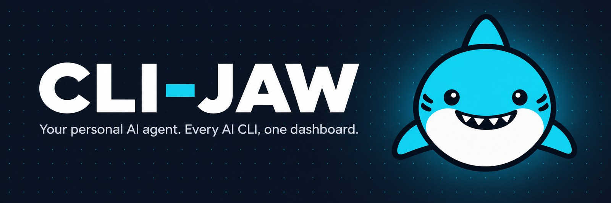

<p align="center">
  
</p>

<p align="center"><b>이미 결제 중인 AI 코딩 CLI를 하나의 비서, 하나의 메모리, 하나의 대시보드로.</b><br>
Claude, Codex, Cursor, Grok, Copilot, OpenCode, Kiro, Antigravity, Pi — 팀처럼 함께 일합니다.</p>

<p align="center">
  <a href="https://npmjs.com/package/cli-jaw"></a>
  <a href="https://github.com/lidge-jun/cli-jaw/releases/latest"></a>
  
  <a href="LICENSE"></a>
</p>

```bash
# 변경을 최소화하려는 기존 사용자: JAW_SAFE=1 npm install -g cli-jaw
npm install -g cli-jaw
jaw dashboard
```

<p align="center">
  <a href="https://github.com/lidge-jun/cli-jaw/releases/latest"></a>
  <a href="https://github.com/lidge-jun/cli-jaw/releases/latest"></a>
  <a href="https://github.com/lidge-jun/cli-jaw/releases/latest"></a>
</p>

<table>
<tr>
<td width="50%" valign="middle">

### 모든 에이전트를 한 곳에서

매니저 대시보드에서 실행 중인 인스턴스를 모두 시작·정지하고 바로 미리 봅니다.

</td>
<td width="50%"></td>
</tr>
<tr>
<td width="50%" valign="middle">

### 작업을 위한 보드

칸반 레인, 우선순위 매트릭스, 리마인더가 각 세션이 하는 일을 추적합니다.

</td>
<td width="50%"></td>
</tr>
<tr>
<td width="50%" valign="middle">

### 에이전트가 읽는 노트

WYSIWYG 편집, 수식, Mermaid 다이어그램을 갖춘 내장 Markdown 워크스페이스입니다.

</td>
<td width="50%"></td>
</tr>
</table>

<p align="center">
  <a href="README.md">English</a> · <b>한국어</b> · <a href="README.zh-CN.md">中文</a> · <a href="README.ja.md">日本語</a> · 📖 <a href="https://lidge-jun.github.io/cli-jaw/"><b>Website</b></a> · <a href="https://lidge-jun.github.io/cli-jaw/dev/">Docs</a>
</p>

---

## CLI-JAW가 뭔가요?

CLI-JAW는 이미 쓰고 있는 AI 코딩 CLI를 **하나의 비서, 하나의 메모리, 하나의 대시보드**로 묶습니다. 메인 CLI(Boss)가 나머지를 "직원"으로 부르므로, 앱 사이를 오가며 복사·붙여넣기할 필요 없이 한 곳에서 지시하면 됩니다.

- **API 키 불필요** — 이미 결제 중인 구독으로 라우팅합니다
- **토큰당 과금 없음** — 기존 월정액 그대로입니다
- **로컬 실행** — 코드가 내 컴퓨터를 벗어나지 않습니다
- **어디서든 접근** — Web, 데스크톱 앱, 터미널, Telegram, Discord, Slack

네이티브 Code API(`/api/code`)는 Codex, Claude, Cursor, Grok 세션을 격리해서 열어 주고, 기록을 영구 보관하며 네이티브 resume을 지원합니다. 자세한 내용은 [native Code 세션](structure/runtime-integration.md#native-code-sessions)을 보세요.

---

## 설치

<details>
<summary><b>안전 설치</b> — 기존 사용자용, 최소 변경</summary>

```bash
# macOS / Linux
JAW_SAFE=1 npm install -g cli-jaw    # skips optional tool/runtime setup
jaw init                              # 준비되면 대화형 설정
```


<!-- windows-support:start GENERATED by scripts/render-windows-support.mts
     native-status: beta
     preferred-path: wsl
     node-floor: 22.4.0
     manager-port: 24576
     runtime-port: 3457
     registered-service: windows-startup
     install-command: irm https://raw.githubusercontent.com/lidge-jun/cli-jaw/main/scripts/install.ps1 | iex
-->

**Windows 지원.** 안정적으로 쓰려면 WSL 경로를 권장합니다. 네이티브 PowerShell 설치 스크립트도 있지만 아직 beta 단계입니다:

```powershell
irm https://raw.githubusercontent.com/lidge-jun/cli-jaw/main/scripts/install.ps1 | iex
```

Node.js 22.4+ 가 필요합니다.

매니저 대시보드는 **24576**, 에이전트별 웹 UI는 **3457** 포트를 씁니다. 실행 정책에 막혀 `jaw.ps1`이 안 돌아가면 정책을 풀지 말고 `.cmd` 쪽을 쓰세요:

```powershell
jaw.cmd doctor
```

네이티브 Windows 자동 실행은 windows-startup 백엔드로 등록됩니다. `jaw service install`은 macOS(launchd), Linux(systemd)에서도 동작합니다.

<!-- windows-support:end -->

어느 쪽이든 이제 cli-jaw가 둘을 정확히 구분합니다. `jaw doctor --json`은 `platform`을 `windows-native` 또는 `wsl`로 보고하고, 각각에 맞는 진단을 내놓습니다. 네이티브 Windows는 이제 WSL interop이 설정돼 있다는 이유만으로 "WSL 안에서 다시 설치하라"는 안내를 받지 않습니다.

</details>

```bash
# macOS / Linux / WSL, Node.js 22.4+가 이미 설치된 경우
npm install -g cli-jaw
jaw dashboard
```

> **npm 12+인가요?** npm이 이제 의존성 설치 스크립트를 기본으로 막습니다. `npm warn allow-scripts`가 보이면 스크립트를 허용해서 설치하세요:
>
> ```bash
> npm install -g cli-jaw --allow-scripts=cli-jaw
> ```

<details>
<summary><b>Windows npm 설치 복구</b> — npm 12+가 스크립트를 막았거나 PowerShell 실행 정책에 걸린 경우</summary>

npm 12+는 CLI-JAW의 의존성 `postinstall`을 막은 채 전역 설치를 끝낼 수 있습니다. 이 패키지만 허용하고 다시 설치하거나, 다음 업그레이드를 위해 허용을 저장하세요:

```powershell
npm install -g cli-jaw --allow-scripts=cli-jaw
npm config set allow-scripts=cli-jaw --location=user
jaw doctor
```

PowerShell에서 스크립트 실행이 비활성화되어 `jaw.ps1`을 로드할 수 없다고 하면, 다음 우회 방법 중 하나를 쓰세요:

```powershell
Set-ExecutionPolicy -Scope CurrentUser RemoteSigned
jaw.cmd doctor
node "$(npm prefix -g)\node_modules\cli-jaw\dist\bin\cli-jaw.js" doctor
```

`jaw.ps1`은 PowerShell용 npm shim이라 실행 정책을 따릅니다. `jaw.cmd`는 같은 역할의 cmd shim이고 그 정책을 쓰지 않습니다. `node` 직접 호출은 shim 둘 다 건너뜁니다. `jaw doctor`는 막혔거나 오래된 설치, 남아 있는 npm staging 디렉터리, 현재 PowerShell 정책을 보고하고, 그에 맞는 복구 안내도 함께 출력합니다.

</details>

끝입니다. 매니저 대시보드는 **http://localhost:24576** 에서 열립니다. 개별 에이전트 Web UI는 `jaw serve`를 실행할 때 **http://localhost:3457** 에서 동작합니다. [Node.js 22.4+](https://nodejs.org)가 필요합니다.

> **처음이세요?** 기본 npm 설치는 CLI-JAW 초기화와 네이티브 Claude 설정을 시도합니다. 다른 AI CLI는 선택 사항입니다. macOS/Linux에서 npm 설치 중 모두 설치하려면 `CLI_JAW_INSTALL_CLI_TOOLS=1 npm install -g cli-jaw`를 사용하세요. Windows에서는 아래 WSL 설치 경로를 사용하세요.

> **은퇴한 런타임.** Claude E(`claude-e`)와 AI-E 멀티플렉서(`ai-e`)는 제거되었습니다. 저장된 선택은 은퇴 상태로 남아 보이지만 실행할 수 없으니 사용 가능한 런타임을 고르세요. 자세한 내용: [runtime integration](structure/runtime-integration.md).

<details>
<summary><b>macOS 원클릭</b> — Node.js가 없다면 이걸로</summary>

```bash
curl -fsSL https://raw.githubusercontent.com/lidge-jun/cli-jaw/main/scripts/install.sh | bash
source "${ZDOTDIR:-$HOME}/.zshrc" 2>/dev/null || true
bash "$(npm root -g)/cli-jaw/scripts/verify-fresh-install.sh"
```

</details>

<details>
<summary><b>Windows (WSL — Windows Subsystem for Linux)</b> — 처음부터 원클릭</summary>

```powershell
# 1. WSL 설치 (관리자 권한 PowerShell)
wsl --install
```

재시작한 뒤 **Ubuntu**를 열고:

```bash
# 2. CLI-JAW + 전체 의존성 설치
curl -fsSL https://raw.githubusercontent.com/lidge-jun/cli-jaw/main/scripts/install-wsl.sh | bash
source ~/.bashrc
jaw dashboard
bash "$(npm root -g)/cli-jaw/scripts/verify-fresh-install.sh"
```

Windows PowerShell에서 WSL로 명령을 넘길 때는 WSL 프로필 PATH가 로드되도록 login shell을 거치세요:

```powershell
wsl.exe -d Ubuntu -- bash -lc "jaw dashboard"
```

</details>

<details>
<summary><b>네이티브 Windows (PowerShell beta)</b> — 분리 실행 서버 로그</summary>

`jaw serve`는 상속한 stdout, stderr 스트림을 그대로 유지하면서 두 스트림을 `<JAW_HOME>\logs\serve.log`에도 덧붙입니다. 시작할 때 파일이 이미 5 MiB라면 한 번 `serve.log.1`로 로테이션합니다. 네이티브 Windows에는 아직 등록된 `jaw service` 로깅 백엔드가 없습니다. PowerShell의 `Start-Process -RedirectStandardOutput/-RedirectStandardError`는 실행할 때마다 대상 파일을 새로 만들거나 비우므로, 그 옵션을 인스턴스가 소유한 `serve.log`에 겨누지 마세요.

운영자가 직접 관리하는 stdout, stderr 파일이 따로 필요하면 자식 PowerShell 프로세스 안에서 리다이렉트하세요. 아래 예시는 `Start-Process`의 잘라내기 기본 동작 없이 `<JAW_HOME>\logs` 아래에 덧붙입니다:

```powershell
$jawHome = 'C:\jaw\worker-a'
$port = 3458
$logDir = Join-Path $jawHome 'logs'
$outLog = Join-Path $logDir 'serve.out.log'
$errLog = Join-Path $logDir 'serve.err.log'
New-Item -ItemType Directory -Force -Path $logDir -ErrorAction Stop | Out-Null
foreach ($path in @($outLog, $errLog)) {
    # OpenOrCreate preserves existing content while proving that the child can append.
    $probe = [IO.File]::Open($path, 'OpenOrCreate', 'Write', 'ReadWrite')
    $probe.Dispose()
}

$jaw = (Get-Command jaw.cmd -ErrorAction Stop).Source
$childCommand = "& '$jaw' --home '$jawHome' serve --port $port --no-open 1>> '$outLog' 2>> '$errLog'"
$encoded = [Convert]::ToBase64String([Text.Encoding]::Unicode.GetBytes($childCommand))
Start-Process -FilePath powershell.exe -ArgumentList '-NoProfile', '-EncodedCommand', $encoded -WindowStyle Hidden | Out-Null
```

`Get-Content -Wait`은 터미널을 점유하므로 각 스트림은 PowerShell 터미널을 따로 열어서 읽으세요. 실행한 터미널의 변수는 새 PowerShell 세션에서 쓸 수 없으므로 아래 명령은 경로를 직접 지정합니다:

```powershell
# Terminal 1
Get-Content -LiteralPath 'C:\jaw\worker-a\logs\serve.out.log' -Tail 100 -Wait

# Terminal 2
Get-Content -LiteralPath 'C:\jaw\worker-a\logs\serve.err.log' -Tail 100 -Wait
```

생명주기 명령은 홈 범위로 동작하며 신호를 보내기 전에 `<JAW_HOME>\jaw.pid.json`을 확인합니다:

```powershell
& $jaw --home $jawHome service stop --port $port
& $jaw --home $jawHome service restart --port $port
```

`service restart`만 따로 실행하면 인스턴스를 백그라운드에서 안전하게 다시 띄우지만, 운영자가 걸어 둔 파일 리다이렉트는 되살리지 못합니다. 파일 수집을 유지하려면 `stop`한 뒤 닫힌 로그를 필요하면 로테이션하고, 위 실행 블록을 다시 돌리세요:

```powershell
$pidFile = Join-Path $jawHome 'jaw.pid.json'
$serverProcess = $null
if (Test-Path -LiteralPath $pidFile -PathType Leaf) {
    $record = Get-Content -LiteralPath $pidFile -Raw -ErrorAction Stop | ConvertFrom-Json
    $serverProcess = Get-Process -Id ([int]$record.pid) -ErrorAction SilentlyContinue
}

& $jaw --home $jawHome service stop --port $port
if ($LASTEXITCODE -ne 0) {
    throw "jaw service stop failed with exit code $LASTEXITCODE"
}
if ($serverProcess) {
    try {
        if (-not $serverProcess.WaitForExit(5000)) {
            throw "jaw serve pid $($serverProcess.Id) did not exit within 5000ms"
        }
    } finally {
        $serverProcess.Dispose()
    }
}

$stamp = Get-Date -Format 'yyyyMMdd-HHmmss'
foreach ($path in @($outLog, $errLog)) {
    if (Test-Path -LiteralPath $path) {
        Move-Item -LiteralPath $path -Destination "$path.$stamp" -ErrorAction Stop
    }
}
# Run the Start-Process launch block above again.
```

`Get-Process node | Stop-Process`는 쓰지 마세요. 관계없는 cli-jaw 인스턴스와 AI 런타임 프로세스까지 종료될 수 있습니다.

</details>

<details>
<summary><b>Fresh-machine evidence</b> — maintainer release check</summary>

설치 스크립트를 바꿔 배포하기 전에 깨끗한 VM에서 실행하세요. 환경 스냅샷, installer 로그, 실제로 실행된 collector/installer/verifier 스크립트, 그 SHA-256 해시, verifier 로그, 새 shell PATH probe를 `~/cli-jaw-fresh-install-evidence-*`에 기록합니다.

```bash
# macOS Terminal
COLLECTOR=/tmp/cli-jaw-collect-fresh-install-evidence.sh
curl -fsSL https://raw.githubusercontent.com/lidge-jun/cli-jaw/main/scripts/collect-fresh-install-evidence.sh -o "$COLLECTOR"
bash "$COLLECTOR" --target macos

# Ubuntu inside WSL
COLLECTOR=/tmp/cli-jaw-collect-fresh-install-evidence.sh
bash "$COLLECTOR" --target wsl
```

Windows PowerShell에서는 지원되는 WSL 경로로 들어가세요:

```powershell
wsl.exe -d Ubuntu -- bash -lc 'COLLECTOR=/tmp/cli-jaw-collect-fresh-install-evidence.sh; curl -fsSL https://raw.githubusercontent.com/lidge-jun/cli-jaw/main/scripts/collect-fresh-install-evidence.sh -o "$COLLECTOR"; bash "$COLLECTOR" --target wsl'
```

collector가 WSL 안에서 `powershell.exe`를 쓸 수 없다고 하면, 감사 전에 Windows PowerShell에서 이것을 실행하세요:

```powershell
wsl.exe -d Ubuntu -- bash -lc 'EVIDENCE_DIR="$(ls -dt ~/cli-jaw-fresh-install-evidence-* | head -1)"; { echo "command=wsl.exe -d Ubuntu -- bash -lc jaw --version"; jaw --version; } | tee "$EVIDENCE_DIR/33-powershell-to-wsl-probe.log"'
```

아직 머지되지 않은 브랜치나 로컬 VM 체크아웃이라면 installer와 verifier를 직접 지정하세요:

```bash
bash scripts/collect-fresh-install-evidence.sh --target macos --install-script scripts/install.sh --verifier-script scripts/verify-fresh-install.sh
bash scripts/collect-fresh-install-evidence.sh --target wsl --install-script scripts/install-wsl.sh --verifier-script scripts/verify-fresh-install.sh
```

수집한 디렉터리는 대상 증거로 쓰기 전에 각각 감사하세요:

```bash
EVIDENCE_DIR="$(ls -dt ~/cli-jaw-fresh-install-evidence-* | head -1)"
AUDITOR="$(npm root -g)/cli-jaw/scripts/audit-fresh-install-evidence.mjs"
node "$AUDITOR" "$EVIDENCE_DIR" --target macos
node "$AUDITOR" "$EVIDENCE_DIR" --target wsl

# For a local checkout, audit with the checkout's auditor:
node scripts/audit-fresh-install-evidence.mjs "$EVIDENCE_DIR" --target macos
node scripts/audit-fresh-install-evidence.mjs "$EVIDENCE_DIR" --target wsl
```

설치 스크립트를 배포하기 전에 두 개의 엄격한 증거 디렉터리로 matrix gate를 실행하세요:

```bash
GATE="$(npm root -g)/cli-jaw/scripts/verify-release-evidence.mjs"
node "$GATE" --macos /path/to/macos-evidence --wsl /path/to/wsl-evidence

# For a local checkout:
node scripts/verify-release-evidence.mjs --macos /path/to/macos-evidence --wsl /path/to/wsl-evidence
```

matrix gate는 오래된 collector, installer, verifier 스크립트로 수집한 증거를 거부합니다. 보관된 증거 스크립트는 gate를 실행하는 현재 패키지나 체크아웃과 일치해야 합니다.

`scripts/promote-to-main.sh`, `scripts/release-preview.sh`, `npm publish`가 이전 태그 이후 installer-sensitive 변경을 감지하면, git push나 npm publish 전에 같은 matrix gate를 실행합니다. 릴리스를 시작하기 전에 증거 디렉터리를 지정하세요:

```bash
CLI_JAW_MACOS_EVIDENCE_DIR=/path/to/macos-evidence \
CLI_JAW_WSL_EVIDENCE_DIR=/path/to/wsl-evidence \
bash scripts/promote-to-main.sh
```

`scripts/promote-to-main.sh`는 **이미 인증된 `preview` head만** 승격합니다. 정확히 그 `preview` SHA에 성공한 `test.yml` push 런이 없으면 시작을 거부합니다. 인자 없이 실행하면 살아 있는 `origin/preview` head를 승격하고, 선택적 SHA 인자는 그 head와 같아야 하므로 오래된 커밋을 승격하는 통로가 아니라 확인용 단언으로 동작합니다.

이 스크립트는 npm publish를 dispatch한 뒤 publish 성공 여부를 확인하지 않고 종료하며, 나중에 다시 실행할 수 없습니다. 일부만 끝난 릴리스의 복구 방법 — npm publish 누락, GitHub release 누락, `latest`의 잘못된 버전, `main`의 빨간 커밋 — 은 [`structure/infra.md` § 릴리스 파이프라인과 부분 실패 복구](structure/infra.md#릴리스-파이프라인과-부분-실패-복구-preview--main--npm)에 정리되어 있습니다.

</details>

<details>
<summary><b>Docker</b></summary>

```bash
docker compose up -d       # → http://localhost:3457
```

</details>

---

## 인증

하나만 있으면 됩니다. 이미 결제 중인 구독을 골라 인증하세요:

```bash
# Free options (no credit card needed)
copilot login        # GitHub Copilot (free tier available)
opencode             # OpenCode — free models available
kiro                 # AWS Kiro (free tier with AWS account)

# Paid (monthly subscription you already pay for)
claude auth login    # Anthropic Claude Pro or higher
codex login          # OpenAI ChatGPT Pro or higher
cursor-agent login   # Cursor
grok login --oauth   # xAI Grok / Grok Heavy
```

한꺼번에 확인: `jaw doctor`

<details>
<summary>jaw doctor 출력 예시</summary>

```
🦈 CLI-JAW Doctor — 13 checks

 ✅ Node.js        v22.15.0
 ✅ Claude CLI      installed
 ✅ Codex CLI       installed
 ✅ Cursor CLI      installed
 ✅ OpenCode CLI    installed
 ✅ Copilot CLI     installed
 ✅ Database        jaw.db OK
 ✅ Skills          29 active, 238 reference
 ✅ MCP (plugins)   3 servers configured
 ✅ Memory          structured/ exists
 ✅ Server          port 3457 available
```

</details>

---

## 무엇을 얻나요

### 직원(Employee): 내 CLI가 다른 CLI를 부릅니다

하나의 AI(Boss)에게 말을 겁니다. 전문 작업이 필요하면 직원에게 태스크를 넘기고, 결과를 검토한 뒤 답합니다. 직원은 각자 자기 CLI와 자기 모델로 동작합니다.

```text
You: "Fix the frontend styling and update the API endpoint"

Boss (Claude)
  ├── Frontend employee (OpenCode) → "Fix the CSS grid layout in dashboard.tsx"
  ├── Backend employee (Codex)     → "Update /api/users to return pagination metadata"
  └── Synthesizes both results for you
```

```bash
jaw dispatch --agent "Backend" --task "Run read-only verification" --watch
jaw dispatch --virtual "security" --task "Review this branch for auth and secret leaks" --watch
```

### PABCD: 계획, 감사, 구현, 검사, 완료

복잡한 작업에서는 CLI-JAW가 정해진 워크플로를 돌립니다. 모든 단계 전환은 사용자가 승인하고, 읽기 전용 워커가 계획과 결과를 검증합니다.

| 단계 | 하는 일 |
|---|---|
| **P — Plan** | Boss가 diff 수준의 계획을 쓰고 확인을 위해 멈춥니다 |
| **A — Audit** | 읽기 전용 워커가 계획이 실행 가능한지 검사합니다 |
| **B — Build** | Boss가 구현하고, 읽기 전용 워커가 검증합니다 |
| **C — Check** | 타입 검사, 문서 업데이트, 일관성 검사 |
| **D — Done** | 모든 변경 요약을 남기고 idle로 복귀 |

상태는 재시작해도 유지됩니다. `jaw orchestrate` 또는 `/pabcd`로 시작하고, `/continue`로 이어가며, 긴 목표는 `/goal`로 살려 두세요. 자세한 내용: [PABCD](https://lidge-jun.github.io/cli-jaw/dev/concepts/pabcd.html).

### 메모리, 스킬, MCP

- **세 개의 메모리 계층** — 최근 세션 기록, 대화에서 뽑아낸 구조화 노트, 검색 가능한 soul/task 스냅샷: `jaw memory search "how did we set up the API auth?"`
- **스킬 200개 이상** — 오피스 문서(PDF, DOCX, XLSX, PPTX, HWP), 브라우저·데스크톱 자동화, 미디어, GitHub, Notion, 개발 가이드: `jaw skill install <name>`
- **모든 엔진을 위한 MCP 설정 하나** — `jaw mcp install @anthropic/context7` 하나로 Claude, Codex, Kiro, OpenCode, Copilot, Antigravity가 한 번에 동기화됩니다

### 브라우저와 데스크톱 자동화

Chrome을 DevTools Protocol로 제어하고, `jaw browser vision-click "Login button"`처럼 설명으로 클릭하며, macOS와 Windows에서 Codex Computer Use로 데스크톱 앱을 다루고, `jaw browser web-ai`로 ChatGPT, Gemini, Grok 웹 UI에 물어볼 수 있습니다.

### 메시징

**Telegram**(음성 메시지, 포럼 토픽, 예약 heartbeat 작업), **Discord**, **Slack**(Socket Mode, 스레드, 파일 중계, 멘션 감시)에서 에이전트와 대화합니다. 여러 채널을 한꺼번에 켤 수 있고, 홈 채널은 능동 발송을 받습니다.

<details>
<summary>Telegram 설정 (3단계)</summary>

1. [@BotFather](https://t.me/BotFather)에서 `/newbot` → 토큰 복사
2. `jaw init --telegram-token YOUR_TOKEN` 또는 Web UI 설정 사용
3. 봇에 아무 메시지나 보내세요. Chat ID는 첫 메시지에서 자동 저장됩니다

</details>

<details>
<summary>Slack 설정 (가이드 마법사)</summary>

1. `jaw slack setup` — 앱 매니페스트를 출력하고 Slack 앱 페이지를 열고, 두 토큰을 실제로 검증한 뒤 설정을 기록합니다
2. 봇이 읽을 각 채널에서 `/invite @cli-jaw` → `jaw serve` 재시작

그룹 DM에는 `message.mpim` 이벤트와 `mpim:history` scope가 필요합니다. 컨테이너에서는 `SLACK_BOT_TOKEN`, `SLACK_APP_TOKEN`, `SLACK_TEAM_ID`, `SLACK_CHANNEL_IDS`가 런타임에 해당 필드를 소유합니다. 자세한 내용: [Slack 도구](docs/slack-tools.md).

</details>

### 데스크톱 앱

Electron 앱은 매니저 대시보드를 띄우고, 번들된 Node.js sidecar를 함께 제공하며, 메뉴 막대에 상주합니다. [GitHub Releases](https://github.com/lidge-jun/cli-jaw/releases/latest)에서 받으세요:

- **macOS (Apple Silicon)** — DMG를 열고 CLI-JAW를 Applications로 끌어다 놓습니다. 빌드는 Developer ID로 서명하고 공증·stapling을 마치며, 앱 안에서 업데이트됩니다.
- **Windows (x64)** — Setup `.exe`를 실행합니다. 서명이 없어 SmartScreen이 확인을 요구할 수 있습니다.
- **Linux (x64)** — AppImage에 실행 권한을 주고 실행합니다.

첫 실행 후 **Install CLI command**를 승인하면(또는 트레이 항목 **Install CLI to Terminal**) 전역 npm 설치 없이 터미널에서 `jaw`를 쓸 수 있습니다.

---

## AI 런타임

토큰당 API 과금 없음. 이미 결제 중인 구독으로 라우팅합니다.

| CLI | 기본 모델 | 인증 | 비용 |
|---|---|---|---|
| **Pi** | `grok-composer-2.5-fast` | Settings profile API key, local proxy, 또는 `PI_CODING_AGENT_BIN` | 격리된 프로필로 로컬/API 엔드포인트 연결 |
| **Claude** | `claude-opus-4-8` | `claude auth login` | Claude Pro 구독 이상 |
| **Antigravity** | AGY-selected | `agy` 실행 시 확인 | 실험적 print-mode 런타임 |
| **Codex** | `gpt-5.5` | `codex login` | ChatGPT Pro 구독 이상 |
| **Codex App** | `gpt-5.5` | `codex login` | ChatGPT Pro 구독 이상 |
| **Cursor** | `composer-2.5` | `cursor-agent login` 또는 `CURSOR_API_KEY` | Cursor 구독 |
| **Grok** | `grok-build` | `grok login --oauth` | Grok 구독 |
| **Kiro** | registry-selected | `kiro` | AWS Kiro 무료 티어 |
| **OpenCode** | `opencode-go/kimi-k2.6` | `opencode` | 무료 모델 사용 가능 |
| **Copilot** | `claude-sonnet-4.6` | `copilot login` | 무료 티어 사용 가능 |

한 엔진이 레이트 리밋에 걸리면 다음 엔진이 이어받습니다(`/fallback`). 엔진 전환은 `/cli codex`, 모델 전환은 `/model gpt-5.5` — Web, 터미널, Telegram, Discord, Slack 어디서든 가능합니다.

---

## CLI

```bash
# Core
jaw dashboard                     # launch manager dashboard
jaw serve                         # start an agent server (http://localhost:3457)
jaw chat                          # terminal chat UI
jaw ask "question"                # one prompt, one answer — no TTY needed
jaw doctor                        # installation and runtime diagnostics

# Instances
jaw clone ~/project                           # clone instance to new directory
jaw --home ~/project serve --port 3458        # run a second instance
jaw service install                           # auto-start on boot (macOS launchd / Linux systemd)
jaw --home ~/project service restart --port 3458  # restart only this instance

# Agents and workflow
jaw employee list
jaw dispatch --agent "Backend" --task "..." --watch
jaw orchestrate                   # PABCD workflow
jaw goal status                   # persistent goals

# Skills, MCP, memory, browser
jaw skill list
jaw mcp install <package>
jaw memory search <query>
jaw browser fetch "https://example.com" --json
```

`jaw clone`으로 만든 인스턴스는 설정, 메모리, 데이터베이스, MCP 설정을 각자 가지며, 매니저 대시보드에서 전부 볼 수 있습니다. 원격·헤드리스 호스트: [structure/remote-headless.md](structure/remote-headless.md). 전체 명령 레퍼런스: [CLI 문서](https://lidge-jun.github.io/cli-jaw/dev/reference/cli.html).

---

## 문서

| 주제 | 위치 |
|---|---|
| 웹사이트와 퀵스타트 | [lidge-jun.github.io/cli-jaw](https://lidge-jun.github.io/cli-jaw/) |
| 가이드, 개념, 레퍼런스 | [개발자 문서](https://lidge-jun.github.io/cli-jaw/dev/) |
| 아키텍처 | [docs/ARCHITECTURE.md](docs/ARCHITECTURE.md) · [structure/](structure/) |
| Slack 도구와 로컬 API | [docs/slack-tools.md](docs/slack-tools.md) |
| 런타임 통합(은퇴한 런타임 포함) | [structure/runtime-integration.md](structure/runtime-integration.md) |

---

## 개발

```bash
npm run build          # tsc → dist/
npm run build:frontend # vite → public/dist/
npm run dev            # tsx server.ts (hot-reload)
npm test               # node:test driver (tests/run.mts)
npm run gate:all       # release/docs parity gates
npm run electron:dev   # desktop app with hot reload
```

---

## 문제 해결

| 문제 | 해결 방법 |
|---|---|
| `cli-jaw: command not found` | `npm install -g cli-jaw`를 다시 실행합니다. macOS/Linux/WSL: `~/.local/bin` 또는 `npm prefix -g` + `/bin`이 `$PATH`에 있는지 확인하세요. Windows PowerShell에서는 login shell을 거쳐 WSL로 실행하세요: `wsl.exe -d Ubuntu -- bash -lc "jaw dashboard"`. |
| `npm warn allow-scripts ...` | npm 12 이상은 의존성 설치 스크립트를 막습니다: `npm install -g cli-jaw --allow-scripts=cli-jaw`, 또는 `npm config set allow-scripts=cli-jaw --location=user`로 유지하세요. 이미 설치했다면 `jaw init`이 설정을 마무리합니다. |
| pnpm/bun이 빌드 스크립트를 막음 | pnpm 11+: `pnpm add -g --allow-build=cli-jaw cli-jaw`. bun: `bun add -g --trust cli-jaw`. |
| 새 설치 verifier 실패 | 안내된 PATH 또는 실행 권한 문제를 고친 뒤 `bash "$(npm root -g)/cli-jaw/scripts/verify-fresh-install.sh"`를 다시 실행하세요. |
| `Error: node version` | Node.js 22.4+로 업그레이드하세요: `nvm install 22` |
| `NODE_MODULE_VERSION` 불일치 | `npm run ensure:native` |
| `EADDRINUSE: port 3457` | 다른 인스턴스가 실행 중입니다. `--port 3458`을 쓰거나 먼저 종료하세요 |
| Telegram / Discord / Slack 인증 실패 | `jaw doctor`를 실행해 토큰을 확인하고 `jaw serve`를 재시작하세요 |
| 직원 디스패치가 멈춤 | `jaw employee list`로 직원 CLI가 인증됐는지 확인하고(`jaw doctor`) `jaw dispatch --watch`로 다시 시도하세요 |

---

## 기여하기

공개 코드와 제품 문서는 이 저장소에 있습니다. 비공개 계획과 이력은 별도 sibling clone인 [cli-jaw-internal](https://github.com/lidge-jun/cli-jaw-internal)에만 두며, 접근 권한은 [이슈](https://github.com/lidge-jun/cli-jaw/issues)로 요청하세요. 이 체크아웃에는 `devlog`, `_plan`, `_fin`, `.jwc` 별칭을 포함한 비공개 기록을 만들지 말고, 공개 문서·소스에 비공개 기록 경로를 넣지 마세요. 변경을 올리기 전에 [로컬 pre-push 설정과 검사](CONTRIBUTING.md#local-private-path-check)를 따르세요.

1. `dev`에서 Fork하고 브랜치를 만듭니다
2. `npm run build && npm run build:frontend && npm test`
3. 릴리스에 민감한 변경은 `npm run gate:all`도 실행합니다
4. PR을 제출합니다

---

<p align="center"><a href="LICENSE"><b>MIT License</b></a> · AI 앱 사이를 오가며 탭을 전환하는 데 지친 개발자들이 만들었습니다.</p>
