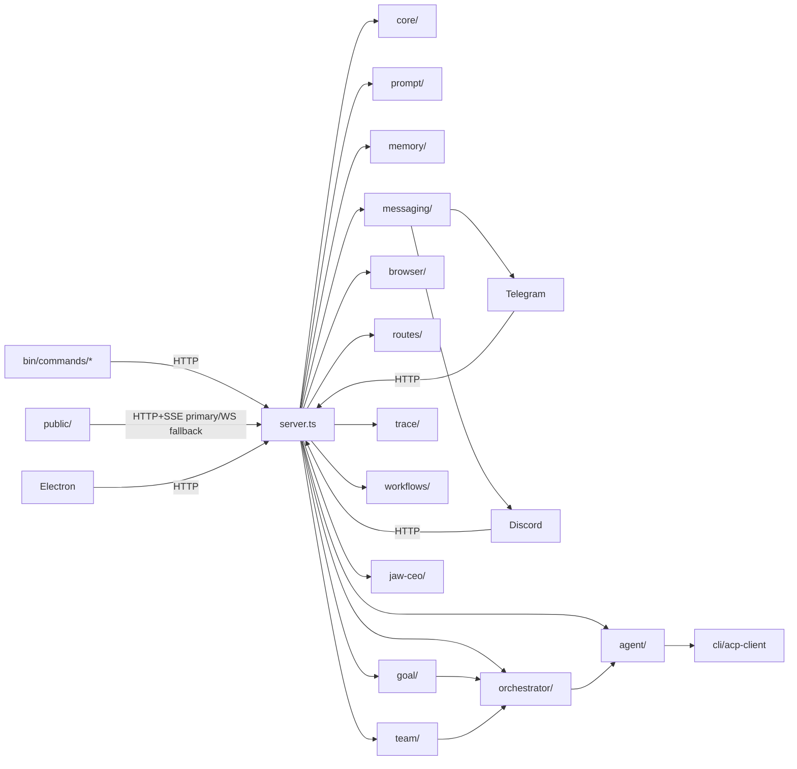

> 📚 [INDEX](INDEX.md) · [체크리스트 ↗](AGENTS.md) · **파일 트리 & 함수 레퍼런스**

# CLI-JAW — Source Structure & Function Reference

> 마지막 검증: 2026-07-10 (image inlay/channel relay SoT sync)
> Native Code sessions live in `src/code-mode/`; the two HTTP hosts share `src/routes/code-body-parser.ts`. The route inventory and its partial-AST boundary are documented in [server_api.md](server_api.md); runtime ownership and replay are documented in [runtime-integration.md](runtime-integration.md). The file tree below is a membership map checked by `verify-counts.sh`; it records no line counts.
>
> 상세 모듈 문서는 [서브 문서](#서브-문서)를 참조하세요.

---

## File Tree

```text
cli-jaw/
├── server.ts                 ← Express 라우트 base + auth/CORS/rate-limit + WS bootstrap + `register*Routes()` glue + startup stale orc_state guard + graceful shutdown(closeDb) + employee migration + seed defaults + registerAvatarRoutes + async listen bootstrap (await initActiveMessagingRuntime) + orphaned jaw-emp-* cleanup + clearAllEmployeeSessions startup + no-store Vite index serving
├── lib/                      ← 외부 통합/공용 헬퍼 (root files + mcp/)
│   ├── mcp-sync.ts           ← MCP 통합 + 스킬 복사 + softResetSkills + runSkillReset + trusted repair gate + clone cooldown
│   ├── mcp/                  ← MCP 모듈 분리
│   │   ├── mcp-registry.ts   ← MCP 레지스트리 관리
│   │   ├── format-converters.ts ← CLI별 MCP 포맷 변환
│   │   ├── skills-distribution.ts ← 스킬 배포/복사 로직
│   │   ├── skills-reset.ts   ← 스킬 리셋 core
│   │   ├── skills-symlinks.ts ← 스킬 심링크 관리
│   │   ├── skills-utils.ts   ← 스킬 유틸리티
│   │   ├── unified-config.ts ← 통합 MCP 설정
│   │   └── mcp-install.ts    ← MCP 설치 헬퍼
│   ├── upload.ts             ← 파일 업로드 + Telegram 다운로드 guards(status/timeout/maxBytes) + 유니코드 파일명
│   ├── media-kind.ts         ← 확장자→image/video/file 판정 단일 소스 (서버·웹 공용, 무의존)
│   ├── stt.ts                ← 음성인식 엔진 (Gemini REST → Whisper fallback, settings.json 연동, mimeType 파라미터)
│   ├── quota-copilot.ts      ← Copilot 할당량 조회 (env → file cache → gh auth token → keychain, execFileSync 보안, source 계정 바인딩) + refreshCopilotFromKeychain
│   └── mime-detect.ts        ← MIME 타입 감지 헬퍼
├── src/
│   ├── core/                 ← 의존 0 인프라 계층
│   │   ├── config.ts         ← JAW_HOME, settings, APP_VERSION + migrateSettings legacy Claude model normalization + avatar settings deep merge + default `settings.pi` + corrupt settings backup + CLI 탐지 re-export hub
│   │   ├── cli-detection.ts  ← CLI 탐지 + `pi` npm-exec fallback + `kiro-code`(`kiro-cli` binary) 탐지 + local package release/debug candidates
│   │   ├── compact.ts        ← compact 헬퍼 (COMPACT_MARKER_CONTENT, managed summary builder, cutoff logic, harvestGitGrep + harvestChatGrep 1KB/1KB budget split)
│   │   ├── instance.ts       ← 인스턴스 ID, node/jaw 경로, 유닛명 sanitize
│   │   ├── session-generation.ts ← persistent chat_sessions.generation (not process-local spawn tokens)
│   │   ├── db.ts             ← SQLite 스키마 + prepared statements + trace + tool_log + working_dir migration + user_version schema migration + closeDb() WAL checkpoint + checkOrphanedWal + busy_timeout + clearMessagesScoped + queued_messages table + model-aware clearEmployeeSession + getRecentMessagesLite + searchMessages(days+recent scope) + getMessageContext(±N range)
│   │   ├── db-maintenance.ts ← legacy tool_log 재살균 1회 마이그레이션(schema_migrations 마커) + page/freelist 통계 + checkpoint+VACUUM (`jaw db maintain`)
│   │   ├── chat-sessions.ts  ← 채팅 세션 CRUD + 활성 세션 전환
│   │   ├── rate-limit.ts     ← 클라이언트 클래스별(cli/manager/browser/lan/remote) 슬라이딩 윈도 리미터 + atomic peek/commit + Retry-After 미들웨어 팩토리
│   │   ├── bus.ts            ← public SSE publish + 내부 리스너 fan-out
│   │   ├── logger.ts         ← 로거 유틸 + structured log.event
│   │   ├── i18n.ts           ← 서버사이드 번역
│   │   ├── employees.ts      ← Employee 시드/CRUD 공용 로직 + 정적 직원 등록(Control: codex `gpt-5.6-luna` + `codex-imagegen`) + virtual synthetic row/preset helpers + DEFAULT_EMPLOYEES
│   │   ├── main-session.ts   ← 메인 세션 authoritative CLI/clear-state helper + clearBossSessionOnly
│   │   ├── message-summary.ts ← message preview/summary helper
│   │   ├── path-expand.ts    ← shell-style path expansion helper
│   │   ├── runtime-settings.ts ← settings side effects 통합 helper
│   │   ├── runtime-settings-gate.ts ← settings mutation in-flight gate
│   │   ├── codex-config.ts   ← Codex config.toml read-only diagnostics
│   │   ├── runtime-path.ts   ← buildServicePath() PATH 보강 (nvm/fnm/homebrew/volta/asdf/cargo/bun/yarn/pnpm 14+ dirs) + win32 MSYS/Cygwin 항목 정규화
│   │   ├── noninteractive-path.ts ← 비대화형 셸(ssh 원샷)에서 jaw 해석 가능 여부 판정 + 처방 (#479)
│   │   ├── cli-detect.ts     ← PATH 후보 spawnability 검사 + rejected candidate reason 수집
│   │   ├── browser-open.ts   ← 브라우저 open 정책/명령 실행 helper
│   │   ├── browser-open-default.ts ← OS/headless 기본 open 여부 판별
│   │   ├── strip-undefined.ts ← 설정/응답 객체 undefined 제거 helper
│   │   ├── boss-auth.ts      ← boss/employee scope 분리용 auth helper
│   │   ├── claude-install.ts ← Claude CLI 설치 상태 점검 helper
│   │   ├── launchd-cleanup.ts ← launchd stale plist / runtime cleanup
│   │   ├── launchd-plist.ts  ← launchd plist 생성 helper
│   │   ├── tcc.ts            ← macOS TCC / screen-recording 권한 점검
│   │   ├── settings-merge.ts ← perCli/activeOverrides/pi deep merge
│   │   └── skill-cache.ts    ← 활성 스킬 슬래시 커맨드 캐시 (registerSkillLoader, getSkillCommandsCache, invalidateSkillCommandsCache)
│   ├── code-mode/            ← native Code sessions, independent of Jaw orchestration
│   │   ├── host.ts ← per-backend lazy composition and storage
│   │   ├── manager.ts ← session index, admission and resource capacity
│   │   ├── session.ts ← captured turn ownership, cancellation and accepted-buffer drain
│   │   ├── normalize.ts ← redacted materialized transcript and coalescing
│   │   ├── store.ts ← SQLite ownership, replay, snapshots and byte budgets
│   │   ├── provider.ts ← native handle and turn-context contracts
│   │   ├── types.ts ← internal session and store contracts
│   │   ├── wire.ts ← public request/event DTOs
│   │   └── providers/        ← direct native adapters and capabilities
│   │       ├── catalog.ts ← model/capability descriptions
│   │       ├── live-models.ts ← last-known opencodex catalog, refreshed in background
│   │       ├── codex-app.ts ← Codex app-server adapter
│   │       ├── claude.ts ← Claude native adapter
│   │       ├── acp.ts ← shared ACP resource ownership
│   │       ├── cursor.ts ← Cursor native adapter
│   │       └── grok.ts ← Grok native adapter
│   ├── agent/                ← CLI 에이전트 런타임 (root files + events/ + spawn/)
│   │   ├── runtime/          ← shared native contract foundation (provider activation follows separately)
│   │   │   ├── acp/          ← shared v1 wire boundary and bounded native transport
│   │   │   │   ├── runtime-session.ts ← captured native turn, raw outcome and passive claim/finalize
│   │   │   │   ├── replacement.ts ← provider-neutral cancel/drain/dispatch controller
│   │   │   │   ├── replacement-turn.ts ← one logical result and synchronous input-commit barrier
│   │   │   │   ├── projection.ts ← structural message boundaries over shared projection
│   │   │   │   ├── content.ts ← bounded ACP content extraction without retaining binary payloads
│   │   │   │   ├── session.ts ← protocol session, prompt/cancel fences and drain
│   │   │   │   ├── cursor-session.ts ← existing-login factory and owned startup abort
│   │   │   │   ├── grok-session.ts ← dedicated existing-auth factory and startup reaping
│   │   │   │   ├── grok-options.ts ← literal-auto admission and advertised model/effort
│   │   │   │   ├── grok-events.ts ← optional aggregate usage from original prompt result
│   │   │   │   ├── grok-control.ts ← compatibility names for the shared replacement controller
│   │   │   │   ├── config.ts ← bounded negotiated model/effort selection
│   │   │   │   ├── notification-queue.ts ← per-turn serialized work with byte/count caps
│   │   │   │   ├── wire.ts  ← strict single-envelope decoder shared with Copilot
│   │   │   │   ├── connection.ts ← bounded full-duplex framing, dispatch/result and close ownership
│   │   │   │   ├── permissions.ts ← native kind policy and opaque decision handles
│   │   │   │   └── callbacks.ts ← bounded permission wait, cancellation latches and private replies
│   │   │   ├── liveness.ts ← private captured identity observer, composed with collector callbacks
│   │   │   ├── requests.ts   ← ephemeral exact-bound decision registry and safe-view admission
│   │   │   ├── claude-sdk-session.ts ← internal persistent query, captured text turns and awaited disposal
│   │   │   ├── claude-sdk-events.ts ← parent tool/text/reasoning/usage mapping and exact final outcome
│   │   │   ├── claude-sdk-permissions.ts ← captured live approvals/questions, bounded views and exact response mapping
│   │   │   ├── claude-sdk-owners.ts ← bounded declared-ID ownership, waiter resolution and retirement
│   │   │   ├── claude-sdk-children.ts ← foreground lineage, bounded reconciliation and declaration handoff
│   │   │   ├── claude-sdk-content.ts ← bounded in-memory text/image encoding without path or URL reads
│   │   │   ├── claude-sdk-messages.ts ← bounded UTF8 blocks and streamed/snapshot reconciliation
│   │   │   ├── claude-sdk-input.ts ← bounded single-consumer input admission
│   │   │   ├── claude-sdk-loader.ts ← optional exact SDK lazy import and retry
│   │   │   ├── claude-sdk-options.ts ← validated prepared configuration and environment snapshot
│   │   │   ├── claude-sdk-process.ts ← owned SDK process and native Windows launch
│   │   │   ├── claude-sdk-roots.ts ← observed single root identity and bounded acquisition
│   │   │   ├── claude-sdk-close.ts ← synchronous fence and physical close barrier
│   │   │   ├── claude-sdk-metadata.ts ← per-turn tokens and cumulative-cost delta
│   │   │   ├── claude-sdk-hooks.ts ← foreground-only unsupported-task boundary
│   │   │   ├── claude-run-controls.ts ← captured cancellation/completion registry, not a scheduler
│   │   │   ├── start-failure.ts ← last native start failure code per CLI, codes only
│   │   │   ├── grok-main.ts  ← Grok replacement and aggregate-usage composition
│   │   │   ├── replace-turn.ts ← typed local-dispatch/no-start/fatal main receipt
│   │   │   ├── pi-projection.ts ← Pi raw tool snapshots and accepted text/reasoning projection
│   │   │   ├── pi-turn.ts ← Pi typed terminal and invocation settlement accumulator
│   │   │   ├── pi-raw-trace.ts ← bounded delta-only raw retention with explicit control summaries
│   │   │   ├── print-projection.ts ← pure accepted print-content observer, no answer selection
│   │   │   ├── print-activity.ts ← journal composition and contained bypass closure
│   │   │   ├── projection.ts ← bounded redaction-before-clip snapshots and per-run failure latch
│   │   │   ├── codex-projection.ts ← owned Codex notification mapping
│   │   │   ├── outcome.ts   ← non-journal native result handoff and stop precedence
│   │   │   ├── session.ts   ← native session/turn/control port
│   │   │   ├── pi-runtime-session.ts ← Pi NativeRuntimeSession adapter, ACP-style claim/finalize, two-outcome cancel
│   │   │   └── events.ts    ← validated trace-first semantic emitter
│   │   ├── native-runtime-run.ts ← one lease/claim/lifecycle with bounded exceptional cleanup
│   │   ├── merge-tool-log.ts ← exact run/item latest merge with terminal precedence and omission preservation
│   │   ├── runtime-pool-contract.ts ← type-only shared store/lease/provider access contract
│   │   ├── claude-runtime-pool.ts ← Claude acquisition and physical/logical retirement over shared stores
│   │   ├── claude-runtime-run.ts ← native Claude main adaptation to shared host/lifecycle and fallback terminal ordering
│   │   ├── prompt-context.ts ← history/operational/partial boundaries and bounded accepted Cursor redirects
│   │   ├── steer-input-guard.ts ← transient scoped Stop fence through fallback enqueue
│   │   ├── spawn.ts          ← CLI spawn + ACP/Codex App/Pi RPC/AGY/Kiro plain text/log session capture + v2 SQLite session resume + 큐 + 메모리 flush + 429 retry timer + isAgentBusy/isSteerInProgress + buildHistoryBlock compact cutoff + working_dir scoping + enqueue→processQueue race fix + QueueItem persistent DB queue + makeCleanEnv PATH augment
│   │   ├── spawn/            ← spawn 서브모듈
│   │   │   ├── queue.ts      ← QueueItem persistent DB queue + processQueue race fix + enqueue/dequeue + drainRecoveredQueue (부팅 시 복구 큐 기동, server.ts가 transport 준비 후 호출) + `_fromQueue` 표식 (대기자 없는 턴을 채널이 답할 수 있게)
│   │   │   ├── resume.ts     ← session resume logic + stale resume detection
│   │   │   └── process-kill.ts ← child process kill helper
│   │   ├── events/           ← NDJSON 이벤트 파서 모듈 분리
│   │   │   ├── index.ts      ← 이벤트 라우터 + logEventSummary + stepRef correlation + compact event parsing + duplicate suppression + claude message_start 경계
│   │   │   ├── helpers.ts    ← summarizeToolInput(type-safe) + toolType/detail 필드 + flushClaudeBuffers
│   │   │   ├── claude.ts     ← Claude thinking_delta/input_json_delta 버퍼 + content_block_stop flush + 메시지 경계 LAST-WINS
│   │   │   ├── opencode.ts   ← OpenCode event adapter + step 경계 last-step-wins
│   │   │   ├── grok.ts       ← Grok throttled visible thinking + event adapter
│   │   │   ├── codex.ts      ← Codex item.started/completed + toolLog running→done dedup
│   │   │   ├── acp.ts        ← ACP session/update 이벤트 + agent_message_chunk messageId 보존
│   │   │   ├── cursor.ts     ← Cursor event adapter + tool/message-boundary LAST-WINS
│   │   │   ├── summary.ts    ← event summary formatters
│   │   │   ├── tool-labels.ts ← tool name→label mapping
│   │   │   └── types.ts      ← event type definitions
│   │   ├── spawn-env.ts      ← spawn용 child env 빌더 (AGY NO_COLOR, OpenCode/Gemini permissions config 주입 등)
│   │   ├── args.ts           ← CLI별 인자 빌더 + AGY print-mode/`--log-file`/`--conversation` resume args + Pi session bucket 분리
│   │   ├── agy-bootstrap.ts  ← AGY bootstrap/context preparation helpers
│   │   ├── agy-capabilities.ts ← AGY `--help`/`--version` capability probe + cached optional flag support map + legacy emit-all fallback marker
│   │   ├── agy-transcript-watcher.ts ← AGY transcript/log watcher and session-id extraction support
│   │   ├── pi-runtime.ts     ← Pi profile 정규화 + isolated `PI_CODING_AGENT_DIR` models/settings 생성 + `pi --offline --list-models` discovery + `pi --mode rpc` JSONL parser/spawner (단일 launch/reader/writer 소유자) ✨
│   │   ├── lifecycle-handler.ts ← child lifecycle + fallback/retry + queue resume orchestration + clearEmployeeSession on resume failure + stale resume fresh retry + kickGoalContinuation export + clearGoalTimers + goal continuation boundary row
│   │   ├── kiro-auth.ts      ← Kiro CLI auth store reader (resolveKiroDataPath, readKiroAuthFromStore, resolveKiroProfileArn, regionFromProfileArn, listKiroConversationIdsForCwd, resolveKiroSessionIdAfterSpawn, extractKiroSessionIdFromV2Store)
│   │   ├── kiro-models.ts    ← Kiro live model inventory (KiroModelEntry, KiroModelInventory, parseKiroModelListJson, fetchKiroModelInventory)
│   │   ├── kiro-runtime.ts   ← Kiro plain-text stdout parser + session capture (isKiroPlainTextCli, processKiroStdoutChunk, flushKiroStdoutContext, appendKiroStdoutChunk, captureKiroSessionIdAfterExit, stripKiroAnsi, parseKiroAssistantText, isKiroStaleSessionOutput, isKiroResumeDegradedOutput, KiroStreamEvent, KiroStdoutContext)
│   │   ├── cursor-runtime.ts ← Cursor CLI event adapter + session management ✨
│   │   ├── cursor-acp-models.ts ← Cursor print → ACP model id rewrites verified against the advertised set
│   │   ├── agy-runtime.ts    ← AGY timeout stdout/close-text 판별 + 최종 planner 기준 timeout suffix 정규화 + stdout/log conversation id 추출 + quiet completion/replay/prompt-echo stripping helper
│   │   ├── alert-escalation.ts ← alert escalation event helper
│   │   ├── cli-helpers.ts    ← Claude-like CLI 판별 helper
│   │   ├── codex-app-client.ts ← Codex App stdio server client
│   │   ├── codex-host-pool.ts ← Codex App shared host generation + lane lease/FIFO/reaper/shutdown owner
│   │   ├── codex-app-events.ts ← Codex App turn/tool/message event adapter + phase 판정 + applyCodexAppTextEvent
│   │   ├── error-classifier.ts ← stderr/result 기반 에러 분류 헬퍼 + shouldAnnounceStallTruncation (부분 출력 워치독 종료를 독자에게 알릴지 판정)
│   │   ├── stall-notice.ts   ← 워치독 중단 통지 문구 + 접미사 전용 제거 (사람에겐 보이고 모델 컨텍스트엔 안 들어가도록 db 조회 경계가 사용) ✨
│   │   ├── grok-trace-backfill.ts ← Grok trace backfill helper ✨
│   │   ├── live-run-state.ts ← active run snapshot / hydrate helper
│   │   ├── memory-flush-controller.ts ← assistant 완료 후 메모리 flush lock + trigger 제어
│   │   ├── mcp-passthrough.ts ← MCP passthrough boundary helpers for agent runtime integration
│   │   ├── opencode-diagnostics.ts ← OpenCode permissions/env audit + raw event 진단 헬퍼
│   │   ├── session-persistence.ts ← main-session persistence policy + ownership generation
│   │   ├── resume-classifier.ts ← stale resume signature classifier
│   │   ├── smoke-detector.ts ← smoke response 감지 + auto-continue 판단
│   │   ├── tool-timeout.ts   ← tool inactivity timeout helper
│   │   ├── watchdog.ts       ← idle/progress watchdog + 4h absolute hard cap with progress deadline extension
│   │   └── events.ts         ← legacy re-export stub → events/ 모듈
│   ├── messaging/            ← 통합 메시징 런타임
│   │   ├── runtime.ts        ← 채널 lifecycle (init/shutdown/restart) + transport registry
│   │   ├── send.ts           ← 통합 아웃바운드 메시지 라우팅 (ChannelSendRequest, 다중 채널 send 지원, 턴 주소 우선순위)
│   │   ├── turn-conversation.ts ← 턴이 답하는 대화 주소 encode/decode + 채널 매칭 ✨
│   │   ├── turn-delivery.ts  ← 에이전트 자가 전송 claim (턴 앵커 + digest, 소비형) → dispatch 중복 게시 억제 ✨
│   │   ├── dedupe.ts         ← 배달 중복 제거 (TTL seen-set, 미만료 항목 보존) ✨
│   │   ├── retry.ts          ← 전송 실패 분류 (format/rate-limit/ambiguous) ✨
│   │   ├── fold.ts           ← 정규화 폴딩 엔진 (escape 디코드 + invisible 제거 + NFKC, 오프셋 맵 추적) ✨
│   │   ├── redact.ts         ← 채널 크리덴셜 마스킹 (Slack/TG/Discord 토큰 + URL 경로 capability) ✨
│   │   ├── chunk.ts          ← 공유 메시지 분할 (무손실 + 서로게이트 안전 + 펜스/언어태그 보존, 단 delimiter가 한도 이내일 때) ✨
│   │   ├── channel-health.ts ← 채널 헬스 체크 helper + additive ingress/metrics snapshot ✨
│   │   ├── channel-validate.ts ← 온보딩 마법사 라이브 크리덴셜 검증 (telegram getMe / discord users@me / slack auth.test+connections.open, 토큰 비로깅) ✨
│   │   ├── send-result.ts    ← send result type helper ✨
│   │   ├── session-key.ts    ← 세션 키 헬퍼
│   │   ├── thread-target.ts  ← Telegram forum topic `message_thread_id` 정규화 helper
│   │   ├── types.ts          ← MessengerChannel, OutboundType, RemoteTarget 타입
│   │   ├── extract-images.ts ← Markdown AST 로컬 이미지 후보 추출 + 확장자 필터/중복 제거/4개 cap
│   │   ├── access-policy.ts   ← remote command access-policy substrate (deny/allowlist/paired/all)
│   │   ├── approval-presentation.ts ← Telegram/Discord/Slack Approve/Deny keyboards + opaque appr/aprd ids
│   │   ├── remote-command-context.ts ← channel-neutral remote command identity
│   │   ├── ingress-generation.ts ← envelope → chat_sessions.generation lookup (0 if unbound)
│   │   ├── effect-once.ts    ← protected-effect claim FSM (claimed|completed|failed|manual, lease+token CAS)
│   │   ├── outbound-outbox.ts ← reserve-before-send outbox + ambiguous FSM
│   │   ├── trace-context.ts  ← ALS MessagingTraceContext; reuses journal trace_id
│   │   ├── metrics.ts       ← in-process counters/histograms; labels channel/state/result only
│   │   ├── durable-ingress.ts ← inbound journal FSM + admit/settle + session_generation + operator list/replay
│   │   ├── ingress-audit.ts  ← append-only replay audit JSONL
│   │   ├── inbound-envelope.ts ← InboundEnvelope normalizers
│   │   ├── ack-reaction.ts   ← inbound ACK reaction lifecycle (serialized transitions + per-channel defaults + nested ack merge)
│   │   ├── queue-notice.ts   ← queue-notice lifecycle (deferred close + bind race drain + bounded shutdown registry)
│   │   ├── forwarder-origin.ts ← channel forwarder 공통 origin 필터 (own channel + producer-owned heartbeat skip)
│   │   ├── native-body.ts    ← native runtime terminal 태그 술어 + 배달 정책 래퍼 (3봇+collector 공유) ✨
│   │   ├── file-receipt.ts   ← 파일 전송 confirmation 어휘 (confirmed|unconfirmed) + 채널별 unconfirmed 에러코드 ✨
│   │   ├── queue-notice-record.ts ← durable notice 기록 best-effort 래퍼 factory (channel+logPrefix) ✨
│   │   ├── target-reply-guard.ts ← standing target-reply 공통 admission (accept identity 데이터화 + 주소 검증) ✨
│   │   ├── channel-adapter.ts ← ChannelAdapter contract
│   │   ├── channel-capabilities.ts ← closed capability set + generated matrix
│   │   ├── delivery-outcome.ts ← DeliveryReceipt classification
│   │   ├── draft-stream.ts   ← draft stream helper
│   │   └── slack-target.ts   ← Slack target helper
│   ├── orchestrator/         ← 직원 오케스트레이션 + 인터페이스 통합
│   │   ├── state-machine.ts ← IPABCD 상태 머신 (I=Interview pre-plan) + broadcast(state,title) + worklog 타이틀 파싱 + employee terminology + OrcContext.workingDir + OrcContext.interview + Project root dispatch contract + Phase60 actor-aware canTransition(GateInput) form-only evidence gate + STATE_PROMPTS --attest instructions
│   │   ├── pipeline.ts       ← IPABCD orchestration (explicit entry only) + interview first-turn detection + plan context persistence + memorySnapshot injection + reset clears boss session + OrcContext workingDir init + Approved Plan Project root guard + remote-channel elicitation guard + bounded delayed worker replay notice + Phase60 phase_attestation strip/fallback + no-state narration warn
│   │   ├── distribute.ts     ← runSingleAgent + buildPlanPrompt + parallel helpers + tiered findEmployee + employee resume diagnostics + virtual employee session-skip
│   │   ├── parser.ts         ← triage + subtask JSON + verdict 파싱 + isResetIntent
│   │   ├── gateway.ts        ← submitMessage 통합 진입점 (WebUI+CLI+TG+Discord 공통) + working_dir scoped insertMessage
│   │   ├── collect.ts        ← orchestrateAndCollect + orchestrateAndCollectData
│   │   ├── session-work.ts   ← hasChatSessionWork — 세션 삭제 전 진행중 작업 관측 (활성 run·큐·replay는 정확 매칭, drain/retry/hold/worker/lane은 scope 단위 보수적 판정) ✨
│   │   ├── scope.ts          ← remote binding key + channel gate + local session scope + captured execution binding; legacy findActiveScope만 default fallback
│   │   ├── worker-monitor.ts ← Worker stall detection — activity timestamps + stall/disconnect/timeout callbacks
│   │   ├── worker-progress.ts ← 직원 progress safe-summary sanitizer + runId-aware current/previous snapshot types
│   │   ├── worker-registry.ts ← Worker 프로세스 레지스트리 + runId progress current/previous memory retention + pending replay metadata + durable worker-run hook
│   │   ├── worker-replay-notice.ts ← delayed worker replay bounded notice builder + runId recovery command contract
│   │   ├── worker-run-store.ts ← Worker run safe metadata/events JSONL store + worker_run_* SSE broadcast bridge + shared status category projection
│   │   ├── worker-output-store.ts ← Worker raw output file store + bounded offset/limit read API
│   │   ├── workspace-context.ts ← Project root/path hint resolver for employee dispatch context
│   │   ├── friction.ts       ← Interview friction/stagnation detector
│   │   ├── seed.ts           ← Interview seed/ontology builder
│   │   ├── sanitize.ts       ← Interview tracker strip helper + stripPhaseAttestation re-export
│   │   └── attestation.ts    ← Phase60 PABCD evidence gate: parse/validate <phase_attestation> + C→D binary/raster artifact observation hard-block + stripPhaseAttestation + warn-only no-state narration detector
│   ├── prompt/               ← 프롬프트 조립 (templates/)
│   │   ├── builder.ts        ← runtime-only desktop-control 조건부 주입(shouldIncludeDesktopControlSection, persisted A-1 불변) + A-1/A-2 + 스킬 + 직원 프롬프트 v2 + promptCache (4-segment key: emp:role:phase:workingDir) + on-demand dev skill path contract + advanced memory mode branch + bounded disk soul/instance context + task snapshot injection + dashboard-connector anchor preserve + Phase60 inline PABCD guide --attest evidence note
│   │   ├── runtime-context.ts ← 런타임 컨텍스트 주입 (RuntimeContextEntry, loadEntries, getActiveEntries, addEntry, removeEntry, clearAll, buildInjectionBlock)
│   │   ├── soul-bootstrap-prompt.ts ← LLM 기반 soul.md 개인화 부트스트랩 프롬프트 빌더
│   │   ├── template-loader.ts ← 프롬프트 템플릿 로더
│   │   └── templates/        ← 프롬프트 템플릿 (a1-system.md, a2-default.md, employee.md, orchestration.md, control-system.md, worker-context.md, vision-click.md, skills.md, heartbeat-*.md)
│   │       └── control-system.md ← Control GUI/image-generation capability boundary + on-demand skill loading contract
│   ├── cli/                  ← 커맨드 시스템 (root files + tui/)
│   │   ├── commands.ts       ← 슬래시 커맨드 레지스트리 + workflow metadata + 디스패처 + 파일경로 필터 + /commands alias /cmd + /settings fullscreen transition + /orchestrate alias /pabcd + /compact + /plan + /search + /gd force-done alias + artifact persistence
│   │   ├── handlers.ts       ← core command handlers + runtime/completion re-export hub + compact re-export + unknown command recovery payload
│   │   ├── handlers-runtime.ts ← memory/browser/prompt/quit/file/steer/forward/fallback/flush/ide/orchestrate 핸들러 + `LEGACY_MODEL_CLI_HINTS`
│   │   ├── handlers-completions.ts ← `/model` `/cli` `/skill` `/employee` `/browser` `/fallback` `/flush` 인자 자동완성 헬퍼
│   │   ├── handlers-workflows.ts ← `/plan` PABCD P 안내 + `/interview` `/deliberate` `/planaudit` prompt handlers + `/review` project-dir workflow + `/goal` gated stub + `/goal run` preflight gate + `/gd` force-done alias
│   │   ├── handlers-search.ts ← `/search` search-skill routing handler + steer prompt submit/remote-safe result split
│   │   ├── handlers-skill-invoke.ts ← `/skill:<id>` handler — SKILL.md 전문을 steerPrompt로 주입, submitMessage 라우팅
│   │   ├── handlers-project.ts ← `/project` 커맨드 핸들러 (projectDirs 관리) ✨
│   │   ├── api-auth.ts       ← CLI→server Bearer token bootstrap (`getCliAuthToken`, `authHeaders`, `cliFetch`)
│   │   ├── claude-models.ts  ← Claude 정규 모델셋 (CLAUDE_CANONICAL_MODELS, CLAUDE_LEGACY_VALUE_MAP) + migration/validation helpers
│   │   ├── compact.ts        ← /compact 슬래시 커맨드 핸들러 (Claude native + managed 경로 분기) + working_dir scoped
│   │   ├── registry.ts       ← 10개 CLI/모델 단일 소스 + canonical defaults + top-level `pi`/`agy`/`cursor`/`kiro-code`
│   │   ├── registry-live.ts  ← buildLiveCliRegistry — Kiro/Cursor/Grok/Claude/AGY/OpenCode/Copilot inventory + ocx 모델/모델별 effort 동적 병합 (effortsByModel/defaultEffortByModel)
│   │   ├── readiness.ts      ← CLI별 인증/설치 상태 점검 + Pi npm-exec readiness + AGY runtime auth hint (CliReadiness[])
│   │   ├── acp-client.ts     ← Copilot ACP JSON-RPC 클라이언트
│   │   ├── command-context.ts ← 공유 커맨드 컨텍스트 팩토리 + runSkillReset 위임 + regenerateB 유지
│   │   ├── connector.ts      ← dashboard connector CLI API bridge (board/notes/reminders/audit)
│   │   ├── reminders.ts      ← local reminders CLI action helpers
│   │   ├── types.ts          ← CLI helper shared result/shape 타입 + workflow command/artifact/recovery metadata contract + command help detail key
│   │   └── tui/              ← TUI 모듈 (32 direct files)
│   │       ├── activity.ts   ← bounded Activity display/disclosure and release
│   │       ├── activity-answer.ts ← exact answer provenance, receipt binding and correction
│   │       ├── activity-history.ts ← read-only journal/saved-answer panel and paste drain
│   │       ├── activity-linear.ts ← classic incremental Activity output
│   │       ├── activity-terminal-text.ts ← provider VT sanitation and bounded cell wrapping
│   │       ├── cell-width.ts ← shared grapheme cell-width policy
│   │       ├── store.ts      ← TuiStore (transcript + overlay 상태 통합), OverlayState + SelectorState + settings screen state
│   │       ├── events.ts     ← TUI WS event normalizer (`agent_done.toolLog` bounded backfill 포함)
│   │       ├── transcript.ts ← TranscriptItem union (user/assistant/status) + TranscriptState + tool full-sweep/live-tool drain helpers
│   │       ├── composer.ts   ← Issue #66 pasted-text composer state + bracketed paste parser + slash gate + PasteCollapseConfig
│   │       ├── overlay.ts    ← help overlay + command palette + choice selector 렌더링
│   │       ├── slash-surface.ts ← fullscreen slash command surface row composer
│   │       ├── settings-screen.ts ← fullscreen Appearance settings row builder + renderer + patch resolver
│   │       ├── keymap.ts     ← 키 입력 분류 + batched TTY chunk tokenization (ctrl-c/ctrl-d/ctrl-k/ctrl-o/enter/backspace/printable/escape)
│   │       ├── panes.ts      ← PaneState (openPanel, side, preferredWidth), PanelKind 6종
│   │       ├── shell.ts      ← ShellLayout 계산 + scroll region setup/cleanup + ensureSpaceBelow
│   │       ├── renderers.ts  ← visualWidth (CJK/emoji cell width) + clipTextToCols/wrapTextToCols ANSI-safe terminal width helpers + cursorScreenPos
│   │       ├── mode.ts       ← TUI mode state (simple/fullscreen) ✨
│   │       ├── file-mention.ts ← file mention autocomplete helper ✨
│   │       ├── editor.ts     ← external editor launch helper ✨
│   │       ├── text-buffer.ts ← TextBuffer class (cursor/insert/delete/selection) ✨
│   │       ├── theme.ts      ← TUI color theme definitions ✨
│   │       ├── diffview.ts   ← TUI diff view renderer ✨
│   │       ├── stream.ts     ← streaming text accumulator ✨
│   │       ├── markdown.ts   ← TUI markdown renderer ✨
│   │       ├── highlight.ts  ← TUI syntax highlight helper ✨
│   │       └── render/       ← TUI render sub-modules (frame, layout, mouse, scheduler, viewport) ✨
│   ├── search/               ← 통합 검색 계층 (031-032) ✨
│   │   ├── contract.ts       ← SearchQuery/SearchHit/SearchResultEnvelope 정본 계약 ✨
│   │   ├── provider.ts       ← provider registry + off provider (중복 id 거부, 등록 순서 보존) ✨
│   │   ├── coordinator.ts    ← ready-only 예산 배분 + cursor 상태 기계 + 부분 실패 인벤토리 ✨
│   │   ├── providers/chat.ts ← chat 어댑터 (FTS/trigram/LIKE 폴백, 실제 session_id provenance) ✨
│   │   └── providers/memory.ts ← memory 어댑터 (고정 64-candidate universe, session provenance 표시, sessionFilter 미적용 경고) ✨
│   ├── memory/               ← 데이터 영속화 + advanced memory runtime
│   │   ├── advanced.ts       ← Advanced Memory re-export stub
│   │   ├── bootstrap.ts      ← legacy memory/bootstrap import + structured root 초기화
│   │   ├── heartbeat.ts      ← Heartbeat 잡 스케줄 + cron/anchored-every timer orchestration + minute-slot dedupe + in-flight skip + generation/abort teardown + per-job map prune + 틱마다 run record fold + mention-watch 답변 예산 + script env 채널 시크릿 차단 + fs.watch
│   │   ├── heartbeat-run-record.ts ← 틱 결과 어휘 (execution/delivery 분리) + 연속 실패·연속 skip 2-카운터 fold + failing 임계값
│   │   ├── heartbeat-schedule.ts ← Heartbeat schedule normalize + cron validate/match + timezone validate + immediate cron loop helper
│   │   ├── heartbeat-mention-watch.ts ← Slack mention 항목 loop + busy yield + 답변 단계 wall-clock 예산 + scanIncomplete/hitCapReached drain 신호 + server-owned thread send + WatchNamespace 경유 ledger 접근
│   │   ├── mention-watch-ledger.ts ← v2 ledger 단일 접근 경로 (WatchNamespace = job+workspace+user, 모든 SQL이 3파트 predicate 유지, A/B 대칭 테스트가 최종 보증) ✨
│   │   ├── legacy-mention-watch-quarantine.ts ← v1 ledger 격리 상태 기계 (durable pending, downgrade 재출현 시 재격리, fresh-start 승인은 archive→delete→CAS 단일 트랜잭션) ✨
│   │   ├── identity.ts       ← `shared/soul.md` 관리 + soul runtime helper
│   │   ├── indexing.ts       ← FTS5/BM25 reindex + indexed file/chunk 상태 집계
│   │   ├── injection.ts      ← memory injection policy + advanced/basic search routing
│   │   ├── keyword-expand.ts ← search keyword expansion + provider config normalize
│   │   ├── memory.ts         ← Persistent Memory grep 기반
│   │   ├── reflect.ts        ← episode → shared/procedures reflection + promoted fact 정리
│   │   ├── runtime.ts        ← Advanced Memory 런타임: bootstrap/import/FTS5 인덱스/BM25 검색/task snapshot/delta reindex
│   │   ├── shared.ts         ← file/meta/frontmatter 공용 헬퍼
│   │   ├── synonyms.ts       ← keyword synonym expansion helper ✨
│   │   └── worklog.ts        ← Worklog CRUD + phase matrix
│   ├── telegram/             ← Telegram 인터페이스
│   │   ├── reactions.ts     ← ACK reaction transport + ReactionTypeEmoji allowlist + notice transport
│   │   ├── ipv4-fetch.ts    ← IPv4 fetch factory that honours init.signal (destroys on abort)
│   │   ├── fetch-body.ts    ← node-fetch 응답 body의 WHATWG/Node stream 호환 변환
│   │   ├── status-update-buffer.ts ← Telegram 상태 업데이트 직렬화 버퍼
│   │   ├── update-offset.ts ← durable getUpdates frontier 저장·재개 poller
│   │   ├── callback-query.ts ← 만료된 Telegram callback acknowledgement를 비치명적으로 처리
│   │   ├── bot.ts            ← Telegram 봇 + forwarder lifecycle + origin 필터링 + channel-origin text/image reply + elicitation callback + voice 핸들러 등록
│   │   ├── voice.ts          ← 음성 메시지 → guarded download → STT → tgOrchestrate 파이프라인
│   │   ├── forwarder.ts      ← text 전송 뒤 guarded local-image photo relay + escape/chunk/createForwarder
│   │   ├── rich-message.ts   ← Bot API 10.1 rich-first send (sendTelegramMarkdown, 32k chunk, HTML/plaintext fallback)
│   │   ├── elicitation-buttons.ts ← single_select elicitation → inline keyboard + pending store + callback codec
│   │   ├── hub-callback.ts   ← hub-member callback URL SSRF guard
│   │   └── telegram-file.ts  ← Telegram 파일 전송 + 재시도 + 사이즈 검증
│   ├── discord/              ← Discord 인터페이스
│   │   ├── bot.ts            ← Discord 봇 + transport 등록 + message/attachment 핸들러 + channel-origin image relay
│   │   ├── reactions.ts   ← ACK reaction transport + cancellable notice REST
│   │   ├── commands.ts       ← Discord slash command 등록 + 핸들러
│   │   ├── send-only-client.ts ← Discord send-only client (webhook/DM fallback) ✨
│   │   ├── channel-types.ts  ← Discord channel type helpers ✨
│   │   ├── forwarder.ts      ← Discord text chunk 포워딩 + guarded local-image attachment relay
│   │   └── discord-file.ts   ← Discord 파일 전송
│   ├── slack/                ← Slack 인터페이스 (Socket Mode + Web API, SDK 없음)
│   │   ├── socket.ts         ← Socket Mode client (apps.connections.open → wss, ack-before-work, envelope dedupe TTL, hello deadline, backoff 재연결)
│   │   ├── bot.ts            ← Slack 봇 lifecycle + attachPort 성공 후 best-effort 자기선출/영속화 + envelope routing + orchestrate 경로 + queued-result waiter + top-level/thread 1회 context prefetch
│   │   ├── api.ts            ← Slack Web API fetch wrapper (HTTP 200 + ok:false를 실패로 처리, credential/URL redaction, Retry-After)
│   │   ├── format.ts         ← CommonMark → mrkdwn 변환 + code-fence 보존 chunking
│   │   ├── blocks.ts         ← Block Kit validation and per-table message splitting
│   │   ├── table-content.ts ← Bounded ordered-cell comparison and CommonMark character references
│   │   ├── table-verification.ts ← Persisted table verification, mismatch/unavailable status
│   │   ├── render-features.ts ← Expected and persisted rich-format feature verification
│   │   ├── events.ts         ← fail-closed attachPort 판정 + inbound gating (self-echo/bot/subtype/allowlist/mention) + Block Kit 텍스트 추출
│   │   ├── thread-tracker.ts ← 참여 스레드 영속 추적 + thread/channel owner-generation singleflight (mention/봇응답 마킹, 캡드 셋, 무멘션 스레드 연속 대화 게이트 지원)
│   │   ├── enrichment-cache.ts ← 공용 동시성 프리미티브 (TTL/cap 캐시, 원인별 억제, 능력 잠금 단일 재탐침, in-flight 합류, 집계 취소, 세대 무효화)
│   │   ├── conversation.ts   ← 대화/스레드 컨텍스트 (conversations.info + replies cursor 최대 10페이지 + parent/최신 50, 참여자는 author 유도, method별 억제·시작률)
│   │   ├── context.ts        ← 프롬프트 컨텍스트 블록 조립 (채널 id·thread_ts 무절단, 섹션별 코드포인트 예산 ~9200 총 overhead, 신뢰 경계 문구 보존)
│   │   ├── history.ts        ← 동적 조회 (conversations.history/replies form-encoded 래퍼 + cursor 정규화 + 재시도 + 에이전트용 포맷/redact)
│   │   ├── mention-watch.ts  ← 가입 채널 backward mention scan + frontier/resume/round-robin/429 stop/60-channel overflow + hitCapReached 보고
│   │   ├── mention-watch-match.ts ← mention/talk 조건 + extra subjects + authors/authorDeny (evaluateMessagingAccess는 authors가 있을 때만)
│   │   ├── attachment-recovery.ts ← app_mention 봉투에 없는 첨부를 channel+ts 재조회로 복구 (oldest+inclusive+limit=1)
│   │   ├── commands.ts       ← slash command → 공유 parseCommand/executeCommand 파이프라인
│   │   ├── slack-file.ts     ← files.getUploadURLExternal → upload → completeUploadExternal 3단계 업로드 (파일명·캡션 모두 아웃바운드 마스킹)
│   │   ├── ingress.ts        ← 세션별 ingress lane + synthetic top-level followup override + admitSlackRun 동기 실행 예약(sessionLanes) + 전역 다운로드 세마포어 + shutdown abort/drain ✨
│   │   ├── inbound-file.ts   ← 인바운드 첨부 단일 IO owner (files.info → 인증 스트리밍 다운로드 → saveUpload, 파일/메시지 바이트 예산, 고정 error code) ✨
│   │   ├── inbound-url.ts    ← 인바운드 다운로드 URL 검증 (Slack host allowlist + https-only hop + 사설망 거부) ✨
│   │   ├── send-only-client.ts ← bot-token outbound with separate transport/verification receipts
│   │   ├── forwarder.ts      ← agent_done 포워딩 + guarded local-image relay (filename caption)
│   │   ├── send-handler.ts   ← ChannelSendRequest → Slack Web API 어댑터 + 413 텍스트 다운그레이드
│   │   ├── manifest.ts       ← Slack 앱 표시명 검증 + bot 표시명 결정적 파생을 포함한 매니페스트 single source (`jaw slack manifest`/`setup`이 사용)
│   │   ├── scope-status.ts   ← OAuth grant drift 단일 소유자 (auth.test의 x-oauth-scopes를 manifest 요구 집합과 대조, 미관측을 '이상 없음'과 구분, doctor·health·identity 경고가 공유) ✨
│   │   ├── allowlist-audit.ts ← channelIds 변경 방향 분류 + 축소 감사 기록 (게이트 리더 기준 정규화, route·settings watcher 양쪽이 공유) ✨
│   │   ├── hot-notify.ts     ← CLI 설정 변경 후 실행 중 서버 hot-reload 통지 (loopback PUT /api/settings → transport 재시작, version skew 감지)
│   │   ├── progress.ts       ← native plan stream + explicit unsupported fallback, bounded IO/Retry-After and terminal receipt
│   │   ├── progress-activity.ts ← safe fixed-category activity projection, bounded recent observations and delivery receipt
│   │   ├── progress-files.ts ← shared bounded file target projection under captured working directory
│   │   ├── progress-detail.ts ← explicit purposes and finite safe command action summaries
│   │   ├── progress-lifecycle.ts ← request/native identity binding, safe buffers and owned terminal teardown
│   │   ├── progress-restore.ts ← generation-bound single-flight status recovery and abort ownership
│   │   ├── reply-delivery.ts ← bounded start proof and atomic reply workflow claims independent of display expiry
│   │   ├── verified-workspace.ts ← 토큰이 실제로 가리키는 team id (auth.test 1회 + 토큰별 캐시, settings.teamId 불신, 실패 시 null로 거부) ✨
│   │   └── register.ts       ← lazy transport 등록 (inbound + send)
│   ├── browser/              ← Chrome CDP 제어 + web-ai 자동화 + adaptive-fetch
│   │   ├── connection.ts     ← Chrome 탐지/launch/CDP 연결 + readiness polling + retry + headless + runtime diagnostics/orphan cleanup + activePort/active-tab 상태 관리
│   │   ├── launch-policy.ts  ← browser start mode 정규화 + agent/debug/manual launch policy
│   │   ├── actions.ts        ← snapshot/click/type/navigate/screenshot + observePageIdentity(신선도 전용 저비용 프로브) + browser primitive actions
│   │   ├── primitives.ts     ← low-level CDP primitives
│   │   ├── vision.ts         ← vision-click 파이프라인 + Codex provider(--ephemeral, stdin ignore, 남은 예산 기반 timeout) + reconcile와 무관한 신선도 거부 + 실패 코드 명명
│   │   ├── vision-input.ts   ← 미신뢰 target 정화(quote-run 붕괴, 제로폭/bidi 제거, surrogate-safe 절단) + stdout 상한
│   │   ├── grounding-candidate.ts ← grounding-candidate-v1 스키마 + brace 스캐너(중첩/stray-quote 복구) + 좌표 타당성/경계 검증
│   │   ├── image-size.ts     ← PNG/JPEG 헤더에서 캡처 픽셀 크기 판독(실패 시 null → fail-closed)
│   │   ├── occlusion.ts      ← 클릭 지점 페이지 hit-test 함수 + 가림 판정(자손/label/presentational은 통과, 미확인은 fail-open)
│   │   ├── verify-candidate.ts ← 후보 주변 확대 크롭 기하 + 2차 응답 드리프트 판정(합의 시 좌표 교체) + remainingObservationBudget
│   │   ├── vision-provider.ts ← codex 호출 인자 구성(샌드박스 우회는 명시적 opt-in, 기본 off) + Windows 종료코드 해석
│   │   ├── grounding-eval.ts ← 평가 하니스 채점(오클릭/기권/그라운딩실패/오류 분리, click 버킷 기준 rate, nearest-rank 백분위) + classifyFailure 5분류
│   │   ├── runtime-diagnostics.ts ← runtime diagnostics helper
│   │   ├── runtime-owner.ts  ← browser runtime owner management
│   │   ├── runtime-owner-store.ts ← runtime owner store
│   │   ├── runtime-orphans.ts ← orphan process cleanup
│   │   ├── tab-lifecycle.ts  ← tab lifecycle management
│   │   ├── index.ts          ← re-export hub
│   │   ├── adaptive-fetch/   ← Adaptive web fetch 서브모듈 (scheduler/stage-types P0 + browser pool/proxy/BM25/Camoufox/yt-dlp) ✨
│   │   │   ├── index.ts      ← adaptive fetch orchestrator
│   │   │   ├── safety.ts     ← URL/content safety checks
│   │   │   ├── endpoint-resolvers.ts ← reader API endpoint resolution
│   │   │   ├── browser-escalation.ts ← fallback to browser fetch
│   │   │   └── ... (14 more: fetcher, content-scorer, validators, metadata, transforms, trace, waf-profiles, browser-session, human-loop, output, browser-runtime, third-party-readers, reader-adapters, challenge-detector)
│   │   └── web-ai/           ← Web AI 브라우저 자동화 (96 TS files; ChatGPT/Gemini/Grok + session-artifacts/capability-probe/tier-timeout/watcher-lock)
│   ├── ide/                   ← IDE 연동 (jaw chat TUI 전용)
│   │   └── diff.ts            ← git diff 감지 + IDE diff 뷰 + 서브모듈 재귀 + fingerprint 비교
│   ├── project-git-summary.ts ← Web UI header용 read-only primary project git summary helper (`projectDirs[0]`, branch/hash, modified/untracked counts, home path guard) ✨
│   ├── routes/               ← Express 라우트 추출 (36 TS files: registrar + helper modules + extracted base-route modules, 199 direct app route registrations incl. `/`)
│   │   ├── code-body-parser.ts ← shared worker/Manager Code envelope policy
│   │   ├── code-native.ts ← native session API and retired-route responses
│   │   ├── code.ts ← workspace picker and Git summary helpers
│   │   ├── _http-error.ts    ← route-level HTTP error helper (status/code/detail 추출)
│   │   ├── types.ts          ← `AuthMiddleware` shared type
│   │   ├── static.ts         ← root/uploads/widgets + guarded local image/video `/api/image` 서빙
│   │   ├── employees.ts      ← employee CRUD 라우트
│   │   ├── heartbeat.ts      ← heartbeat read/write 라우트 + GET에 lastRun 병합
│   │   ├── skills.ts         ← skill list/enable/disable/reset 라우트
│   │   ├── jaw-memory.ts     ← jaw memory search/read/list/save/init/reflect/flush/soul/soul-activate/bootstrap 라우트
│   │   ├── jaw-ceo.ts        ← Jaw CEO channel/session support routes ✨
│   │   ├── i18n.ts           ← locale bundle 라우트
│   │   ├── orchestrate.ts    ← IPABCD reset/state/workers/worker-runs/snapshot/queue cancel/queue steer async accept/dispatch/virtual dispatch/batch safe summary/worker result/state PUT 라우트 + Phase60 boss-token actor distinction + --attest body gate + single-use pendingAttestation null-clear
│   │   ├── memory.ts         ← memory status/KV/files/settings 라우트
│   │   ├── settings.ts       ← settings/prompt/project pick/git summary/heartbeat-md/MCP/registry/status/quota/copilot + Pi profile register/model discovery 라우트 + CLI_KEYS 기반 quota parity/status-only metadata
│   │   ├── messaging.ts      ← upload/file-open/voice/telegram/channel/discord send 라우트
│   │   ├── avatar.ts         ← Agent/User 아바타 이미지 업로드/서빙/삭제 + settings.json 메타 저장 + safeResolveUnder 경로 보호
│   │   ├── quota.ts          ← Copilot/Claude/Codex/Grok/OpenCode quota helper readers + Grok weekly credits + credential-scoped Claude cache
│   │   ├── quota-native-window.ts ← Codex duration-aware and Claude model-scoped quota parsers
│   │   ├── quota-wire.ts ← Bounded upstream bodies, finite percentages and reset normalization
│   │   ├── quota-kiro-reverse.ts ← Kiro/CodeWhisperer quota reader
│   │   ├── quota-agy-reverse.ts ← Native AGY summary/models and local availability orchestration
│   │   ├── quota-agy-auth.ts ← Read-only active account and project discovery
│   │   ├── quota-agy-local.ts ← Process-bound loopback IDE quota reader
│   │   ├── quota-cursor-dashboard.ts ← Cursor dashboard quota reader
│   │   ├── goal.ts           ← goal CRUD + kickGoalContinuation route (registerGoalRoutes)
│   │   ├── goal-run.ts       ← goal-run execution routes
│   │   ├── runtime-context.ts ← runtime context route helpers
│   │   ├── security-audit.ts ← security audit route registrar
│   │   ├── traces.ts         ← public trace summary/events read routes
│   │   ├── runtime-requests.ts ← exact-bound ephemeral native decision GET/POST
│   │   ├── runtime-request-notices.ts ← captured-chat presentation delivery for SSE-only decision hints
│   │   └── browser.ts        ← 브라우저 API 라우트 + `cdpPort(req)` 포트 우선순위 + primitive/tab/debug/doctor/cleanup/web-ai routes
│   ├── security/             ← 보안 입력 검증
│   │   ├── path-guards.ts    ← assertSkillId, assertFilename, assertMemoryRelPath, assertSendFilePath, safeResolveUnder + sendFileAllowedRoots (가드와 진단이 공유하는 허용 루트 단일 소스, 거절 시 detail.allowedRoots로 반환)
│   │   ├── decode.ts         ← decodeFilenameSafe
│   │   ├── network-acl.ts    ← isPrivateIP, isAllowedHost, isAllowedOrigin, originMatchesHost, extractHost
│   │   └── security-audit-log.ts ← SQLite-backed security audit event log ✨
│   ├── http/                 ← 응답 계약
│   │   ├── response.ts       ← ok(), fail() 표준 응답
│   │   ├── async-handler.ts  ← asyncHandler 래퍼
│   │   └── error-middleware.ts ← notFoundHandler, errorHandler
│   ├── types/                ← 공유 타입 정의
│   │   ├── agent.ts          ← ToolEntry, SpawnContext, SpawnResult 인터페이스
│   │   ├── cli-engine.ts     ← CliEngine union + registry key tuple + `agy`/`kiro-code` discriminators
│   │   └── cli-events.ts     ← CLI event record/discriminator helpers
│   ├── command-contract/     ← 커맨드 인터페이스 통합
│   │   ├── catalog.ts        ← COMMANDS → capability map 확장
│   │   ├── policy.ts         ← getVisibleCommands, getTelegramMenuCommands
│   │   └── help-renderer.ts  ← renderHelp list/detail mode
│   ├── goal/                 ← Goal autonomy 시스템
│   │   ├── heartbeat.ts      ← buildGoalContinuation (autonomy override) + shouldHeartbeatContinueGoal + getGoalContinuationPrompt + goal pause audit enforcement + Phase60 evidence-gate --attest self-advance instructions
│   │   ├── pause-gate.ts     ← active + agentPauseCount 기반 derived pauseGate 상태 helper
│   │   ├── runtime.ts        ← WorkflowRuntimeSnapshot + buildRuntimeSnapshot (goal + PABCD + worker registry 통합 스냅샷)
│   │   ├── store.ts          ← GoalState CRUD (getActiveGoal, setGoal, updateGoal, completeGoal, cancelGoal, pauseGoal, resumeGoal, clearGoal, resetGoalStore, goalHasCompletionEvidence, getGoalHistory)
│   │   └── types.ts          ← GoalStatus, GoalBudget, GoalCheckpoint, GoalState, GoalHistory, GoalEvent 타입
│   ├── goal-run/             ← Goal-run 실행 제어
│   │   ├── controller.ts     ← goal-run execution controller
│   │   ├── events.ts         ← goal-run workflow event builders
│   │   ├── failure-matrix.ts ← goal-run failure classification
│   │   ├── policy.ts         ← goal-run preflight gates + budget check
│   │   └── types.ts          ← GoalRunMode, GoalRunBudget, GoalRunSafetyGate, GoalRunState 타입
│   ├── trace/                ← Trace 이벤트 영속화
│   │   ├── activity-journal.ts ← owner-bound immutable replay, sparse cursor and admission budgets
│   │   ├── activity-control.ts ← private control leaf, first loss, close and prefix expiry
│   │   ├── activity-retention.ts ← raw-first pruning and whole-prefix retention
│   │   ├── runtime-body-codec.ts ← canonical runtime body tuples + contextual redaction
│   │   ├── store.ts          ← startTraceRun + appendTraceEvent + stampTraceTool + finalizeTraceRun + pruneTraceEvents
│   │   ├── retention.ts      ← startTraceRetention: boot prune + 6h sweep, {stop(), stopped} 핸들 (server.ts shutdown 이 소유)
│   │   ├── types.ts          ← TraceRunInput, TraceEventInput, TracePointer, TraceRunRow 타입
│   │   └── redact.ts         ← trace event redaction helpers
│   ├── shared/               ← shared runtime, presentation and policy contracts
│   │   ├── elicitation-spec.ts ← structured elicitation schema + validation helper
│   │   ├── runtime-observability.ts ← worker-run/background-task shared runtime status category vocabulary
│   │   ├── runtime-contract.ts ← native session capabilities, turn outcome and presentation event types
│   │   ├── isolated-qa.ts    ← opt-in canonical role homes, strict ports and scrubbed child environment
│   │   ├── runtime-event-parse.ts ← versioned presentation boundary decoder
│   │   ├── presentation.ts   ← independent Activity/Legacy mode and server-supplied identity parser
│   │   ├── activity-state.ts ← bounded pure Activity preview reducer
│   │   ├── activity-kind.ts ← tool name → kind classifier and adjacent render grouping
│   │   ├── activity-replay.ts ← bounded live/replay coordination without I/O
│   │   ├── activity-read.ts ← fixed-through history and exact saved-answer readers
│   │   ├── runtime-request-notice.ts ← versioned metadata-only request wake-up contract
│   │   ├── shell-command-display.ts ← shell command display sanitization helper
│   │   ├── structured-fence.ts ← structured renderer fence scanner/parser helper
│   │   ├── tool-log-sanitize.ts ← tool log sanitization helpers
│   │   └── reminders/tray-triage.ts ← tray reminder badge/count triage helper
│   │   └── shell-command-display.ts ← shell command display formatter
│   ├── manager/              ← Multi-instance 대시보드 매니저 (+telegram-hub/ forum topic routing; design workspace routes; embedded-browser routes; project pick; git scm-snapshot/scm-operation)
│   ├── team/                 ← Team dispatch planner ✨
│   │   ├── planner.ts        ← team task planning logic
│   │   ├── collector.ts      ← team result collector
│   │   ├── dispatcher.ts     ← team dispatch executor
│   │   ├── preflight.ts      ← team dispatch preflight checks
│   │   └── types.ts          ← team dispatch types
│   ├── jaw-ceo/              ← Jaw CEO OpenAI Realtime channel ✨
│   │   ├── realtime-sideband.ts ← OpenAI Realtime API sideband connection
│   │   ├── coordinator.ts    ← CEO session coordinator
│   │   ├── coordinator-admin.ts ← admin commands for CEO channel
│   │   ├── coordinator-workers.ts ← CEO worker management
│   │   ├── coordinator-completions.ts ← CEO completion handling
│   │   ├── coordinator-realtime-tools.ts ← realtime tool definitions
│   │   ├── coordinator-types.ts ← coordinator type definitions
│   │   ├── coordinator-utils.ts ← coordinator utilities
│   │   ├── store.ts          ← CEO session store
│   │   ├── types.ts          ← CEO channel types
│   │   ├── docs-edit.ts      ← document editing via CEO
│   │   ├── completion.ts     ← completion helpers
│   │   ├── policy.ts         ← CEO access policy
│   │   ├── confirmations.ts  ← user confirmation flow
│   │   ├── openai-key.ts     ← OpenAI key resolver
│   │   └── transcript-persistence.ts ← transcript save/load
│   ├── reminders/            ← Reminders bridge ✨
│   │   ├── jaw-reminders-bridge.ts ← jaw↔dashboard reminders bridge
│   │   └── types.ts          ← reminder types
│   └── workflows/            ← workflow helper + employee boundary/handoff/scope-sandbox + deliberate/planaudit/review/search/runtime/guards (root files + 3 subdirs)
│       ├── artifacts.ts      ← JAW_HOME workflow artifact cache + project key/path safety + unknown command recovery artifact
│       ├── plan.ts           ← `/plan` compatibility artifact/text builder
│       ├── scope-sandbox.ts  ← normalizeScope + isProtectedPath + postDispatchDiffCheck
│       ├── employee-boundary.ts ← assertBossOnlyDispatch + assertNoImplementationDelegation + assertReadOnlyAudit
│       ├── handoff.ts        ← buildHandoff (mutable option) + hasImplementationDelegation
│       ├── deliberate.ts     ← `/deliberate` workflow handler
│       ├── planaudit.ts      ← `/planaudit` workflow handler
│       ├── review.ts         ← `/review` projectDirs/recent-context scope resolution + Markdown report path + fix/dispatch steer prompt
│       ├── search.ts         ← `/search` steer prompt builder + search-skill/browser verification policy text
│       ├── competitive-gap.ts ← competitive gap analysis workflow
│       ├── runtime.ts / runtime-guards.ts / guards.ts / events.ts / status.ts / context.ts / index.ts / types.ts / browser-web-ai.ts / web-ai-guards.ts
│       ├── checkpoint/       ← checkpoint store + types ✨
│       ├── permissions/      ← permission policy + types ✨
│       └── context-map/      ← context map builder ✨
├── public/                   ← Web UI (Vite 8 + ES Modules, source/assets,; generated `public/dist` and `public/public/dist` excluded)
│   ├── settings/ ← standalone instance settings entry
│   │   └── index.html ← Classic settings iframe HTML
│   ├── index.html            ← 뼈대 + header project/git status anchor
│   ├── manifest.json         ← PWA 매니페스트
│   ├── sw.js                 ← Service Worker 오프라인 캐시
│   ├── css/                  ← (variables/layout/markdown/chat/diagram/orc-state/sidebar/modals/tool-ui/trace-drawer/workflow-cockpit/chat-search)
│   │   ├── chat.css          ← chat/message/virtual-scroll + inline image min-height/object-fit/error fallback
│   │   ├── native-requests.css ← live decision form, focus and bounded responsive scrolling
│   │   └── activity.css      ← scoped live Activity disclosure and reversible Legacy visibility
│   ├── manager/src/settings-standalone.tsx ← shared instance settings root
│   ├── manager/src/settings/ ← unified instance and Manager settings
│   │   ├── SettingsPage.tsx ← full workspace Back/navigation layout
│   │   ├── settings-icons.ts ← category glyph mapping
│   │   ├── settings-registry.ts ← scope-filtered page registry
│   │   ├── pages/components/SlackSetup.tsx ← native Slack setup dialog
│   │   ├── pages/manager/shared.tsx ← Manager locale copy and row controls
│   │   ├── pages/manager/Display.tsx ← Manager display registry UI settings
│   │   ├── pages/manager/Activity.tsx ← read-only title support
│   │   ├── pages/manager/Developer.tsx ← Manager diff defaults
│   │   ├── pages/manager/Embedding.tsx ← dedicated memory API settings
│   │   └── pages/manager/TelegramHub.tsx ← shared Shell dirty owner for Hub API
│   ├── locales/              ← i18n (ko/en/ja/zh .json)
│   └── js/                   ← (root 21 + features/ 70 + diagram/ 3 + render/ 20, 전 파일 TypeScript; `features/project-git-status.ts`)
│       ├── bounded-api.ts    ← bounded authenticated JSON reads and decision writes
│       ├── ws.ts             ← legacy event dispatch plus scoped snapshot/native request bridge
│       ├── features/
│       │   ├── presentation-preference.ts ← bounded generation-fenced settings preference refresh
│       │   ├── activity-live.ts ← host-port live ownership, final correction and remount
│       │   ├── activity-view.ts ← one-row turn header, grouped rows and remembered choices
│       │   ├── activity-rows.ts ← Codex-style tool row/group DOM builders with icons
│       │   ├── activity-history.ts ← owned transcript restoration, queue and recovery
│       │   ├── activity-http.ts ← authenticated bounded Activity reads
│       │   ├── native-request-bridge.ts ← SSE health/epoch, captured identity and request refresh
│       │   └── native-requests.ts ← live exact-bound approvals/questions and manual recovery
│       └── render/
│           ├── markdown.ts   ← marked/sanitize pipeline + `/media`/guarded `/api/image` inline media rewrite
│           └── delegations.ts ← one-time document capture image-error delegation + render delegation registry
├── electron/                 ← Electron tray background app (41 TS/TSX files) ✨
│   ├── package.json / electron-builder.yml / electron.vite.config.ts
│   └── src/
│       ├── main/index.ts     ← Electron main process — BrowserWindow + tray + jaw server spawn + deep-link + IPC
│       ├── main/lib/qa-session.ts ← isolated QA profile paths before lock and sessions
│       ├── main/lib/tray-menu-model.ts ← pure menu bar instance list model: parse, order, labels, stale marking
│       ├── main/lib/tray-instances.ts ← menu bar instance poller for /api/dashboard/instances
│       ├── main/lib/         ← top-level helpers plus subdirectories (jaw-spawn, tray-manager, tray-instances, tray-menu-model, qa-session, install-cli, dock-icon, terminal, navigation-policy, app-metrics, health-check, deep-link, permissions, path-security, quit-progress, etc.)
│       └── preload/          ← preload scripts (index + metrics)
├── bin/
│   ├── cli-jaw.ts            ← 29개 root dynamic import branch + grouped user-facing 서브커맨드 라우팅 + --home flag
│   ├── _http-client.ts       ← shared HTTP client helper ✨
│   ├── star-prompt.ts        ← `gh` 기반 GitHub star 1회 프롬프트
│   ├── interactive-confirm.ts ← 방향키/`y`/`n`/Enter 인라인 Yes-No 선택기, raw mode 없으면 타이핑 폴백
│   ├── agent-driven.ts       ← 에이전트·CI 실행 감지, 동의 프롬프트를 유저에게 넘기는 판단
│   ├── postinstall.ts        ← npm install 후 CLI 런타임/MCP/스킬 safe 가드; OfficeCLI는 postinstall 자동설치가 아니라 `scripts/install-officecli.sh` 온디맨드 설치
│   ├── helpers/help.ts       ← CLI help text helper
│   └── commands/             ← top-level ts files + `tui/` helper 모듈
│       ├── serve.ts          ← 서버 시작 (--port/--host/--open) + SIGINT child.kill('SIGINT') orphan fix
│       ├── dispatch.ts       ← 직원 호출 (pipe mode 호환) + default safe live progress follow + `--quiet`/`--json` quiet paths + virtual employee dispatch + batch dispatch safe summary + stale/non-JSON route diagnostics + worker result polling + ECONNREFUSED retry
│       ├── chat.ts           ← 터미널 채팅 TUI (3모드, locale bootstrap, refreshInfo, active model 표시, no-arg `/model`·`/cli` selector intercept, transcript 축적, overlay wiring, batched key tokenization, settings snapshot)
│       ├── chat-search.ts    ← 채팅 메시지 히스토리 검색 (--days/--recent/--context/--limit)
│       ├── goal.ts           ← goal autonomy CLI (start/status/pause/resume/stop) ✨
│       ├── project.ts        ← project directory management CLI ✨
│       ├── lock.ts           ← instance lock/unlock for process protection
│       ├── history.ts        ← 채팅 히스토리 검색 CLI
│       ├── init.ts           ← 초기화 마법사 + --safe/--dry-run + --help
│       ├── slack.ts          ← `jaw slack manifest|setup` — 앱 매니페스트 출력 + 가이드 설정 (토큰 prefix 가드 + auth.test/apps.connections.open 라이브 검증 + settings 병합, channel 미변경)
│       ├── doctor.ts         ← 진단 (다중 체크 + claude-i helper/underlying claude + headless 감지, --json)
│       ├── db.ts             ← `jaw db maintain` — WAL checkpoint + VACUUM, before/after page 통계
│       ├── status.ts         ← 서버 상태 (--json)
│       ├── mcp.ts            ← MCP 관리 (install/sync/list/reset)
│       ├── skill.ts          ← 스킬 관리 (install/remove/info/list/reset soft·hard)
│       ├── employee.ts       ← 직원 관리 (list/reset, REST API 호출, JSON/table 출력)
│       ├── worker.ts         ← 직원 progress status/watch CLI + explicit raw `read <runId>` output reader + employee name/id/runId resolver + safe-summary printer
│       ├── reset.ts          ← 전체 초기화 (MCP/스킬/직원/세션)
│       ├── clone.ts          ← 인스턴스 복제 (--from, --with-memory, regenerateB)
│       ├── memory.ts         ← 메모리 CLI (search/read/save/list/init, --chat 통합검색)
│       ├── launchd.ts        ← macOS LaunchAgent 관리
│       ├── service.ts        ← 크로스 플랫폼 서비스 관리 (systemd/launchd/docker)
│       ├── orchestrate.ts    ← IPABCD 상태 제어 CLI (jaw orchestrate [I|P|A|B|C|D|reset]) + Phase60 --attest evidence arg + x-jaw-boss-token header attach
│       ├── browser.ts        ← 브라우저 CLI (primitive + tab/debug + web-ai delegator)
│       ├── browser-web-ai.ts ← `jaw browser web-ai` ChatGPT/Gemini/Grok 자동화 helper
│       ├── dashboard.ts      ← `jaw dashboard serve` + dashboard memory delegation
│       ├── dashboard-memory.ts ← `jaw dashboard memory` L2 federation CLI helper
│       ├── dashboard-chat.ts ← `jaw dashboard chat search` L2 federation CLI helper
│       ├── bgtask.ts         ← server-owned background task CLI add/list/show/cancel + native/shared status display
│       ├── connector.ts      ← dashboard connector board/notes/reminders/audit CLI
│       ├── reminders.ts      ← local reminders list/add/done CLI
│       ├── dispatch-helpers.ts ← dispatch output unwrap helper
│       ├── dispatch-batch-summary.ts ← batch dispatch safe summary printer + recovery command fallback
│       └── tui/              ← chat 터미널 TUI 분리 (api, channel, fullscreen-mode, input-handler, overlays, raw-pipe-mode, renderer, simple-mode, tui-io, types, ws-handler)
├── tests/                    ← 회귀 방지 테스트 (root/unit/integration/browser/fixtures/smoke)
├── scripts/                  ← 도구 스크립트 (TypeScript + Shell + CJS; atomic build, sidecar bundle, release gates, install-risk evidence)
├── officecli/                ← OfficeCLI 포크 서브모듈 (lidge-jun/OfficeCLI, Apache 2.0)
├── skills_ref/               ← 레퍼런스 스킬
│   ├── registry.json         ← public reference skill registry + `codex-imagegen` metadata
│   └── codex-imagegen/
│       └── SKILL.md          ← Codex native image generation, uploads 저장, web/channel 중복 방지 계약
├── docs/                     ← 프로젝트 문서
├── README.md / README.ko.md / README.zh-CN.md / README.ja.md ← 다국어 README
├── tsconfig.json / tsconfig.frontend.json / tsconfig.build.json
├── types/
│   ├── frontend.d.ts         ← CDN 글로벌 타입 선언 (marked, hljs, katex, mermaid, DOMPurify)
│   └── global.d.ts           ← Node + Express 글로벌 타입
├── vite.config.ts            ← Vite 8 빌드 설정
└── package.json / pnpm-workspace.yaml
```

### 런타임 데이터 (`~/.cli-jaw/`)

| 경로               | 설명                                      |
| ------------------ | ----------------------------------------- |
| `jaw.db`           | SQLite DB                                 |
| `settings.json`    | 사용자 설정                               |
| `mcp.json`         | 통합 MCP 설정 (source of truth)           |
| `prompts/`         | A-1, A-2, HEARTBEAT 프롬프트              |
| `memory/`          | Persistent memory (`MEMORY.md`, `daily/`) |
| `skills/`          | Active 스킬 (시스템 프롬프트 주입)        |
| `skills_ref/`      | Reference 스킬 (AI 참조용)                |
| `browser-profile/` | Chrome 사용자 프로필                      |
| `backups/`         | symlink 충돌 시 백업 디렉토리             |

npm 의존성: 라이브 버전은 `package.json`의 `dependencies`를 source of truth로 본다. 주요 축은 Express/WS/SQLite, Telegram/Discord, browser automation, React Manager, markdown/math/diagram rendering stack이다.

dev 의존성: 라이브 버전은 `package.json`의 `devDependencies`를 source of truth로 본다. TypeScript/tsx/Vite/React plugin/jsdom/concurrently/types packages are tracked there.

---

## 코드 구조 개요



### 디렉토리 의존 규칙

| 디렉토리 | 의존 대상 | 비고 |
|---|---|---|
| `core/` `security/` `http/` `shared/` | — | 의존 0 계층 |
| `browser/` | — | 독립 (CDP + adaptive-fetch + web-ai) |
| `messaging/` `cli/` `prompt/` `memory/` | core | 중간 계층 |
| `agent/` | core, prompt, orc, cli/acp, native | 핵심 허브 (Pi RPC/AGY/ACP/Codex/Kiro/Cursor) |
| `goal/` `goal-run/` `trace/` | core, orc, agent | 자율 실행 + 추적 |
| `team/` `jaw-ceo/` `reminders/` | core, orc, agent | 확장 모듈 |
| `workflows/` | orc, agent, core | Employee boundary + checkpoint |
| `orchestrator/` | core, prompt, agent | IPABCD + interview + worker |
| `telegram/` `discord/` | core, orc, agent, messaging | 외부 인터페이스 |
| `routes/` | core, browser, http, security, goal | Express 라우트 |
| `electron/` | server.ts (HTTP) | Electron tray app |
| `server.ts` | 전체 | 글루 레이어 |

---

## 핵심 주의 포인트

1.  **큐**: busy 시 queue → agent 종료 후 자동 처리 (persistent DB queue)
2.  **세션 무효화**: CLI 변경 시 session_id 제거
3.  **직원 dispatch**: `cli-jaw dispatch --agent ... --task ...` shell surface가 현재 실행 경로이며, one-off 전문 검토는 `cli-jaw dispatch --virtual ... --task ...`로 ephemeral synthetic employee를 사용한다. 직원 task body에는 `Project root: <absolute path>`를 명시한다. Human dispatch output은 bounded safe progress를 기본 follow하며, `--quiet`/`--json`은 live progress line을 끈다. Batch dispatch와 delayed replay는 full employee stdout을 boss context/stdout에 자동 주입하지 않고 bounded summary + runId recovery command만 출력한다. Worker progress는 `agentId` compatibility와 per-run `runId`를 함께 노출한다.
4.  **메모리 flush**: `forceNew` spawn → 메인 세션 분리, threshold개 메시지만 요약
5.  **메모리 주입**: MEMORY.md = 매번, session memory = `injectEvery` cycle마다
6.  **에러 처리**: 429/auth 커스텀 메시지 + smart retry + fallback chain
7.  **IPv4 강제**: `--dns-result-order=ipv4first` + Telegram
8.  **MCP 동기화**: mcp.json → 지원되는 MCP-aware CLI 포맷 자동 변환 (lib/mcp/ 모듈)
9.  **이벤트 dedupe**: src/agent/events/ 모듈별 분리 — Claude/Codex/Grok/ACP/Cursor/Gemini/OpenCode
10. **Telegram/Discord origin**: `origin` 메타 기반으로 포워딩 판단
11. **Messaging runtime**: `src/messaging/` — 채널 추상화 (transport registry + unified send + session key + channel-health)
12. **CLI registry**: `src/cli/registry.ts` — 10개 CLI 런타임 정의. `pi`는 top-level RPC runtime, `kiro-code`는 `kiro-cli` binary; `registry-live.ts`가 동적 모델 목록 병합
13. **Copilot ACP**: JSON-RPC 2.0 over stdio, `session/update` 실시간 스트리밍
14. **Goal autonomy**: `src/goal/` — heartbeat continuation + store + runtime snapshot; `src/goal-run/` — execution controller + policy gates
15. **Kiro provider**: `kiro-auth.ts` (auth store reader) + `kiro-models.ts` (live inventory) + `kiro-runtime.ts` (stdout parser) + `registry-live.ts` (dynamic merge)
16. **Pi runtime**: `pi-runtime.ts` + `settings.pi` + `/api/pi/profiles/register` — first-class RPC runtime with isolated profile config and model discovery
17. **Interview enhancement**: `orchestrator/friction.ts` (5-level clarity + oscillation detection) + `seed.ts` (evidence-ref ontology) + `sanitize.ts` (tracker strip) + pipeline.ts budget gate
18. **TUI**: `src/cli/tui/` — event normalizer + transcript model + composer (paste collapse) + overlay (help/palette/selector) + slash-surface + settings-screen + text-buffer + theme + render/ sub-modules; `bin/commands/tui/` — SSE-first `channel.ts`, fullscreen/simple mode + `raw-pipe-mode` (piped `--raw` NDJSON protocol) + input-handler + ws-handler
19. **Electron tray**: `electron/` — sidecar-first packaged server spawn, tray CLI install flow, deep-link, terminal IPC, folder/drop path IPC, navigation policy, permission diagnostics
20. **Adaptive fetch**: `src/browser/adaptive-fetch/` — multi-strategy web fetch (direct → reader API → browser escalation) with WAF detection + content scoring
21. **Team dispatch**: `src/team/` — planner/collector/dispatcher/preflight for structured multi-employee coordination
22. **Jaw CEO**: `src/jaw-ceo/` — OpenAI Realtime API sideband channel + coordinator (admin/workers/completions/realtime-tools)
23. **SSE event channel**: `src/core/event-bus.ts` + `src/routes/events.ts` + `public/js/event-channel.ts` provide `GET /api/events` with replay; worker-run lifecycle publishes safe `worker_run_*` events through the same topic/replay path and bgtask/worker-run payloads share additive `statusCategory` vocabulary; `public/js/ws.ts` remains the legacy browser fallback dispatcher and `bin/commands/tui/channel.ts` provides the SSE-first terminal chat transport.

---

## 서브 문서

| 문서                                               | 범위                                                                          |
| -------------------------------------------------- | ----------------------------------------------------------------------------- |
| [🔧 infra.md](infra.md)                             | core/ (config·db·bus·logger·i18n·settings-merge) + security/ + http/          |
| [🌐 server_api.md](server_api.md)                   | server.ts · routes/ · REST API · WebSocket                                    |
| [⚡ commands.md](commands.md)                       | cli/ (commands·handlers·registry) + command-contract/                         |
| [🤖 agent_spawn.md](agent_spawn.md)                 | agent/ (spawn·args·events) + orchestrator/ (pipeline·parser) + cli/acp-client |
| [📱 telegram.md](telegram.md)                       | telegram/ (bot·forwarder·telegram-file) + memory/heartbeat                    |
| [🎨 frontend.md](frontend.md)                       | public/ 전체                                                                  |
| [🧠 prompt_flow.md](prompt_flow.md)                 | prompt/builder.ts · 직원 프롬프트 · promptCache                               |
| [💾 memory_architecture.md](memory_architecture.md) | 3계층 메모리 시스템                                                           |

---

> 프로젝트 전체 파일 검증 완전 레퍼런스. 상세는 서브 문서 참조.
